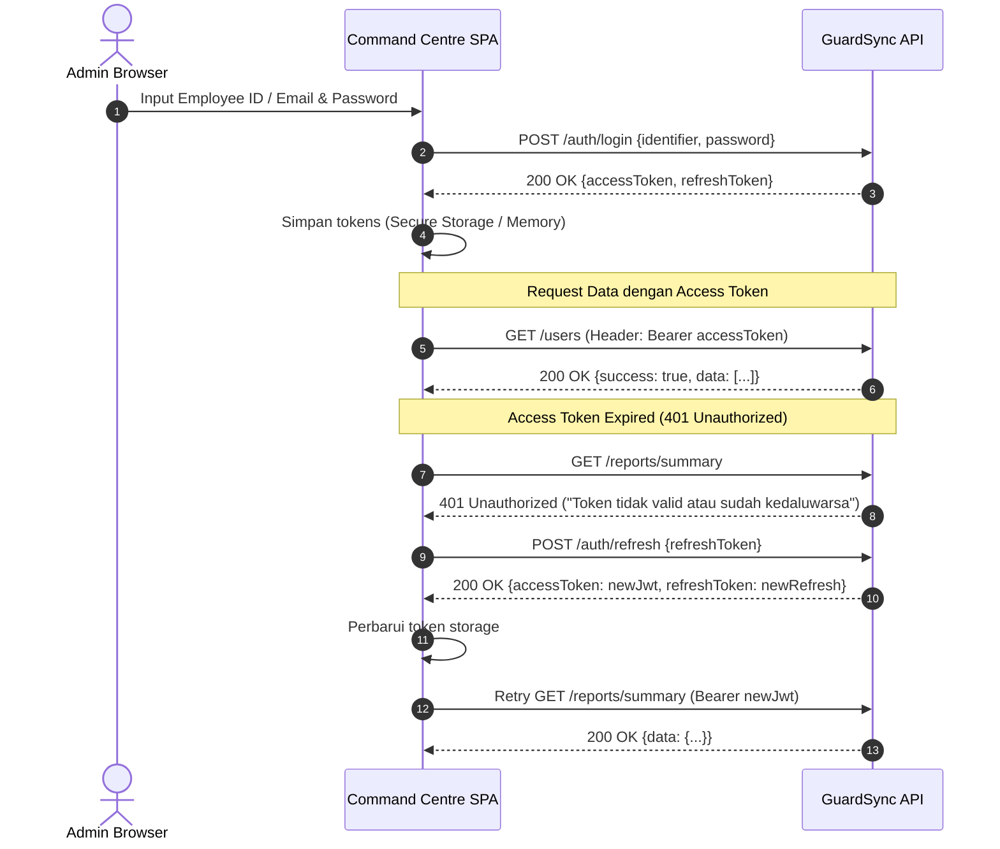

# GuardSync Command Centre — API Documentation & Frontend Implementation Reference
**Target Role:** `SUPER_ADMIN` & `ADMIN`  
**Application:** GuardSync Command Centre (Web Dashboard)  
**Backend Framework:** Laravel 12 (PHP 8.4)  
**Document Version:** 1.0.0  
**Generated Date:** 2026-09-27  

---

## Daftar Isi
1. [Arsitektur & Konsep Dasar API](#1-arsitektur--konsep-dasar-api)
   - [Base URL & Routing Nuance](#base-url--routing-nuance)
   - [Headers Standar](#headers-standar)
   - [Model Autentikasi & Token Lifecycle](#model-autentikasi--token-lifecycle)
   - [Role-Based Access Control (RBAC) & Site Scoping](#role-based-access-control-rbac--site-scoping)
   - [Format Standar Response Envelope & Pagination](#format-standar-response-envelope--pagination)
   - [Penanganan Error & Status Code](#penanganan-error--status-code)
2. [Matriks Hak Akses (SUPER_ADMIN vs ADMIN)](#2-matriks-hak-akses-super_admin-vs-admin)
3. [Spesifikasi Lengkap Endpoint](#3-spesifikasi-lengkap-endpoint)
   - [Modul 1: Autentikasi & Akun](#modul-1-autentikasi--profil-admin)
   - [Modul 2: Manajemen Pengguna (Users)](#modul-2-manajemen-pengguna-users)
   - [Modul 3: Manajemen Situs / Wilayah (Sites)](#modul-3-manajemen-situs--wilayah-sites)
   - [Modul 4: Manajemen Checkpoint & QR Code](#modul-4-manajemen-checkpoint--qr-code)
   - [Modul 5: Manajemen Inventaris (Inventory Pos)](#modul-5-manajemen-inventaris-pos-inventory)
   - [Modul 6: Monitoring Patroli & Review Laporan (Reports)](#modul-6-monitoring-patroli--review-laporan-reports)
   - [Modul 7: Monitoring Sesi Patroli Aktif (Live Command Centre)](#modul-7-monitoring-sesi-patroli-aktif-live-command-centre)
   - [Modul 8: Pengawasan Buku Mutasi & Insiden (LogBooks & LogEntries)](#modul-8-pengawasan-buku-mutasi--insiden-logbooks--logentries)
4. [Panduan Implementation Plan Frontend](#4-panduan-implementation-plan-frontend)
   - [State Management & HTTP Interceptor Flow](#rekomendasi-state-management--interceptor-flow)
   - [Peta Modul & Halaman Frontend Command Centre](#peta-modul--halaman-frontend-command-centre)
   - [Checklist Kebutuhan Komponen Khusus](#checklist-kebutuhan-komponen-khusus)

---

## 1. Arsitektur & Konsep Dasar API

### Base URL & Routing Nuance
> [!IMPORTANT]
> **PENTING UNTUK DEVELOPER FRONTEND:**  
> Routing pada backend GuardSync dikonfigurasikan dengan `apiPrefix: ''` pada `bootstrap/app.php`.  
> Artinya, path endpoint **TIDAK MENGGUNAKAN** prefix `/api/`.  
> Contoh pemanggilan yang benar: `http://localhost:8000/auth/login`, **bukan** `http://localhost:8000/api/auth/login`.

- **Development Base URL:** `http://localhost:8000` (atau sesuai konfigurasi reverse proxy/env)
- **Production Base URL:** `https://api.guardsync.yourdomain.com`

---

### Headers Standar

Setiap HTTP Request dari frontend Command Centre wajib menyertakan header berikut:

| Header | Nilai / Contoh | Keterangan |
|---|---|---|
| `Content-Type` | `application/json` | Wajib untuk request method `POST`, `PATCH`, `PUT` |
| `Accept` | `application/json` | Memastikan server mengembalikan format JSON |
| `Authorization` | `Bearer <accessToken>` | Wajib untuk semua protected endpoint |
| `Accept-Language` | `id` atau `en` | Opsional (default: `id`). Menentukan bahasa pesan `message` respon |

---

### Model Autentikasi & Token Lifecycle

1. **Custom JWT (HMAC-SHA256)**: Backend tidak menggunakan guard default Laravel melainkan service kustom `JwtService`.
2. **Access Token**: Memiliki TTL singkat (default 5 menit - 1 jam). Disertakan di header `Authorization: Bearer <accessToken>`.
3. **Refresh Token**: 
   - Token acak 64 karakter (disimpan sebagai hash SHA-256 di database).
   - **One-time use (Single Use)**: Saat refresh token dikirim ke `POST /auth/refresh`, backend langsung me-revoke token lama dan mengembalikan pasangan access token + refresh token baru.
   - Kadaluarsa refresh token: 7 hari.



---

### Role-Based Access Control (RBAC) & Site Scoping

GuardSync memiliki 4 tingkatan peran:
1. `SUPER_ADMIN` (Akses total seluruh modul, manajemen perusahaan, dan pembuatan/penugasan site global)
2. `ADMIN` (Akses operasional manajerial **hanya pada site-site yang di-assign** oleh SUPER_ADMIN, tidak bisa cross-site)
3. `SUPERVISOR` (Review kunjungan patroli, approval laporan, pengawasan satpam di site yang di-assign)
4. `OFFICER` (Petugas satpam lapangan, mobile app-oriented)

#### Perilaku Site Scoping (`SiteScope`):
- **`SUPER_ADMIN` (GLOBAL Scope):**
  - Memiliki akses tanpa batas ke seluruh site di dalam sistem.
  - Berhak membuat site baru (`POST /sites`), menonaktifkan site (`DELETE /sites/{id}`), dan menentukan penugasan wilayah (assign site) kepada `ADMIN`, `SUPERVISOR`, dan `OFFICER`.
- **`ADMIN` (ASSIGNED Scope - Tidak Bisa Cross-Site):**
  - **Terisolasi pada Assigned Sites:** ADMIN **hanya** dapat mengakses, melihat, dan mengelola data (Petugas, Checkpoint, Inventaris, Laporan Patroli, Sesi Patroli Aktif, Buku Mutasi) pada site yang **secara eksplisit telah ditugaskan (assigned) oleh SUPER_ADMIN** kepadanya via tabel `site_assignments`.
  - **Blokade Cross-Site (403 Forbidden):** Jika seorang ADMIN mencoba mengakses, memfilter, atau mengirim request yang melibatkan `siteId` di luar daftar penugasannya, backend otomatis menolak dengan error **403 Forbidden** (`"Akses ditolak"` / `"Site not assigned"`).
  - **Restriksi Master Site:** ADMIN **tidak diizinkan** membuat site baru (`POST /sites`) atau menghapus/menonaktifkan site (`DELETE /sites/{id}`). Fitur ini eksklusif milik `SUPER_ADMIN`.


---

### Format Standar Response Envelope & Pagination

Semua endpoint mengembalikan respons terbungkus dalam format JSON envelope konsisten:

#### 1. Respons Berhasil Tanpa Pagination (Object / Array Tunggal)
```json
{
  "success": true,
  "message": "Operasi berhasil",
  "data": { ... }
}
```

#### 2. Respons Berhasil Dengan Pagination
```json
{
  "success": true,
  "message": "Daftar pengguna berhasil diambil",
  "data": [
    { ... },
    { ... }
  ],
  "pagination": {
    "page": 1,
    "limit": 10,
    "total": 54,
    "totalPages": 6
  }
}
```

---

### Penanganan Error & Status Code

Jika terjadi kesalahan, backend selalu mengembalikan JSON envelope dengan `success: false`:

```json
{
  "success": false,
  "message": "Pesan error terjemahan sesuai Accept-Language",
  "data": null
}
```

#### Kode Status HTTP Standar:
- `200 OK`: Permintaan berhasil diproses.
- `201 Created`: Entitas baru berhasil dibuat (User, Site, Checkpoint, Inventory, dll).
- `400 Bad Request`: Validasi payload form gagal (`message: "Validation failed"`, dengan rincian field error di dalam `data`).
- `401 Unauthorized`: Token JWT tidak ada, tidak valid, atau kadaluarsa.
- `403 Forbidden`: Role tidak mencukupi atau tidak memiliki izin akses (misal: ADMIN mencoba membuat user ADMIN lain).
- `404 Not Found`: Resource ID (User, Site, Checkpoint, Visit) tidak ditemukan.
- `500 Internal Server Error`: Terjadi kegagalan server yang tidak terduga.

Contoh Respon Error Validasi Form (400 Bad Request):
```json
{
  "success": false,
  "message": "Validasi gagal",
  "data": {
    "employeeId": [
      "The employee id field is required."
    ],
    "role": [
      "The selected role is invalid."
    ]
  }
}
```

---

## 2. Matriks Hak Akses (SUPER_ADMIN vs ADMIN)

Berikut adalah pembagian otoritas fitur antara **SUPER_ADMIN** dan **ADMIN** di Command Centre:

| Modul & Fitur | Endpoint | SUPER_ADMIN | ADMIN |
|---|---|:---:|:---:|
| **Auth: Login / Logout / Refresh / Me / Ganti Password** | `/auth/*` | ✅ Global | ✅ Terikat Akun Sendiri |
| **Users: Lihat Daftar User** | `GET /users` | ✅ Semua User | ✅ Hanya Petugas/SPV |
| **Users: Buat User Satpam (OFFICER / SUPERVISOR)** | `POST /users` | ✅ | ✅ |
| **Users: Buat User ADMIN / SUPER_ADMIN** | `POST /users` | ✅ | ❌ *(403 Forbidden)* |
| **Users: Edit User (Nama, Email, Role, Status)** | `PATCH /users/{id}` | ✅ | ✅ *(Hanya SPV & Officer)* |
| **Users: Nonaktifkan (Soft Delete) User** | `DELETE /users/{id}` | ✅ | ✅ *(Hanya SPV & Officer)* |
| **Users: Reset Password User Langsung** | `POST /users/{id}/reset-password` | ✅ | ✅ *(Hanya SPV & Officer)* |
| **Sites: Buat Site Baru** | `POST /sites` | ✅ | ❌ *(Hanya SUPER_ADMIN)* |
| **Sites: Nonaktifkan (Soft Delete) Site** | `DELETE /sites/{id}` | ✅ | ❌ *(Hanya SUPER_ADMIN)* |
| **Sites: Lihat Daftar Site** | `GET /sites` | ✅ Semua Site | 🔒 *(Hanya Site yang di-assign)* |
| **Sites: Edit Detail & Geofence Site** | `PATCH /sites/{id}` | ✅ Semua Site | 🔒 *(Hanya Site yang di-assign)* |
| **Sites: Assign & Hapus Petugas ke Site** | `POST, DELETE /sites/{siteId}/officers` | ✅ Semua Site | 🔒 *(Hanya Site yang di-assign)* |
| **Checkpoints: Lihat Checkpoint** | `GET /checkpoints`, `GET /checkpoints/{siteId}` | ✅ Semua Site | 🔒 *(Hanya Site yang di-assign)* |
| **Checkpoints: Buat, Edit, Rotasi QR Checkpoint** | `POST, PATCH /checkpoints`, `POST /qr/rotate` | ✅ Semua Site | 🔒 *(Hanya Site yang di-assign)* |
| **Checkpoints: Download QR PNG Cetak** | `GET /checkpoints/{id}/qr` | ✅ Semua Site | 🔒 *(Hanya Site yang di-assign)* |
| **Inventory: Lihat & Kelola Alat Pos** | `GET, POST, PATCH, DELETE /inventory` | ✅ Semua Site | 🔒 *(Hanya Site yang di-assign)* |
| **Reports: Monitor Log Kunjungan & Review** | `GET, PATCH, DELETE /reports/visits/*` | ✅ Semua Site | 🔒 *(Hanya Site yang di-assign)* |
| **Reports: Dashboard Ringkasan & Kepatuhan** | `GET /reports/summary`, `/compliance` | ✅ Semua Site | 🔒 *(Hanya Site yang di-assign)* |
| **Reports: Ekspor Data CSV Kunjungan** | `GET /reports/visits/export` | ✅ Semua Site | 🔒 *(Hanya Site yang di-assign)* |
| **Live Monitoring: Sesi Patroli Aktif** | `GET /patrols/sessions/active` | ✅ Semua Site | 🔒 *(Hanya Sesi di Site assigned)* |
| **Digital LogBook: Pengawasan Mutasi & Kejadian**| `GET /logbooks`, `GET /logentries/{id}` | ✅ Semua Site | 🔒 *(Hanya Site yang di-assign)* |

> 🔒 **Keterangan Simbol:**  
> - `🔒`: Dibatasi secara ketat oleh `SiteScopeService`. Jika ADMIN mencoba mengakses data site di luar penugasannya, sistem akan menolak dengan respon **403 Forbidden**.  
> - `❌`: Fitur ditolak secara permanen oleh role middleware.

---

## 3. Spesifikasi Lengkap Endpoint

### MODUL 1: Autentikasi & Profil Admin

#### 1.1 Login ke Command Centre
- **Method:** `POST`
- **Path:** `/auth/login`
- **Akses:** Publik (tanpa token)
- **Deskripsi:** Autentikasi menggunakan Nomor Induk Karyawan (`employeeId`) **atau** alamat `email`.

**Request Body:**
```json
{
  "identifier": "EMP-ADMIN-01",
  "password": "SecretPassword123!"
}
```
| Parameter | Tipe | Wajib? | Aturan & Keterangan |
|---|---|:---:|---|
| `identifier` | string | Ya | NIK (`employee_id`) atau Email pengguna |
| `password` | string | Ya | Password akun (minimal 8 karakter) |

**Response (200 OK):**
```json
{
  "success": true,
  "message": "Login berhasil",
  "data": {
    "accessToken": "eyJhbGciOiJIUzI1NiIsInR5cCI6IkpXVCJ9...",
    "refreshToken": "4a7f8e3b2c1d9f0e1a2b3c4d5e6f7a8b9c0d1e2f3a4b5c6d7e8f9a0b1c2d3e4f"
  }
}
```

---

#### 1.2 Refresh Access Token
- **Method:** `POST`
- **Path:** `/auth/refresh`
- **Akses:** Publik (mengirimkan refreshToken)
- **Deskripsi:** Memperbarui JWT access token yang sudah kadaluarsa. **Satu kali pakai (One-time use)**: token lama langsung hangus.

**Request Body:**
```json
{
  "refreshToken": "4a7f8e3b2c1d9f0e1a2b3c4d5e6f7a8b9c0d1e2f3a4b5c6d7e8f9a0b1c2d3e4f"
}
```

**Response (200 OK):**
```json
{
  "success": true,
  "message": "Token berhasil diperbarui",
  "data": {
    "accessToken": "eyJhbGciOiJIUzI1NiIsInR5cCI6IkpXVCJ9.new...",
    "refreshToken": "8b9c0d1e2f3a4b5c6d7e8f9a0b1c2d3e4f4a7f8e3b2c1d9f0e1a2b3c4d5e6f7a"
  }
}
```

---

#### 1.3 Ambil Data Profil Admin Login
- **Method:** `GET`
- **Path:** `/auth/me`
- **Akses:** `SUPER_ADMIN`, `ADMIN` (Wajib Header `Authorization: Bearer <token>`)
- **Deskripsi:** Mengambil data user yang sedang login, peran, status, dan penugasan site (jika ada).

**Response (200 OK):**
```json
{
  "success": true,
  "message": "Profil berhasil diambil",
  "data": {
    "id": "9d8b76c5-4321-4f1e-9abc-1234567890ab",
    "employeeId": "EMP-ADMIN-01",
    "email": "admin@guardsync.id",
    "name": "Budi Santoso",
    "role": "ADMIN",
    "active": true,
    "assignments": []
  }
}
```

---

#### 1.4 Ganti Password Pribadi
- **Method:** `PATCH`
- **Path:** `/auth/change-password`
- **Akses:** `SUPER_ADMIN`, `ADMIN`
- **Deskripsi:** Admin mengubah kata sandi akunnya sendiri dengan memverifikasi password lama.

**Request Body:**
```json
{
  "currentPassword": "OldPassword123!",
  "newPassword": "NewStrongPassword456!",
  "newPassword_confirmation": "NewStrongPassword456!"
}
```

**Response (200 OK):**
```json
{
  "success": true,
  "message": "Password berhasil diubah",
  "data": null
}
```

---

#### 1.5 Logout
- **Method:** `POST`
- **Path:** `/auth/logout`
- **Akses:** `SUPER_ADMIN`, `ADMIN`
- **Deskripsi:** Menghapus dan me-revoke refresh token dari database backend.

**Request Body (Opsional):**
```json
{
  "refreshToken": "8b9c0d1e2f3a4b5c6d7e8f9a0b1c2d3e4f4a7f8e3b2c1d9f0e1a2b3c4d5e6f7a"
}
```

**Response (200 OK):**
```json
{
  "success": true,
  "message": "Berhasil keluar",
  "data": null
}
```

---

### MODUL 2: Manajemen Pengguna (Users)

Seluruh route di bawah ini diproteksi oleh middleware `['auth.jwt', 'roles:SUPER_ADMIN,ADMIN']`.

#### 2.1 List Semua Pengguna (Paginated)
- **Method:** `GET`
- **Path:** `/users`
- **Query Parameters:**
  | Parameter | Tipe | Default | Keterangan |
  |---|---|---|---|
  | `page` | integer | `1` | Nomor halaman (minimal 1) |
  | `limit` | integer | `10` | Jumlah data per halaman (1 - 100) |
  | `active` | boolean | `true` | Filter status (`true` = hanya aktif, `false` = termasuk non-aktif) |

**Response (200 OK):**
```json
{
  "success": true,
  "message": "Daftar pengguna berhasil diambil",
  "data": [
    {
      "id": "e2f64ab8-91c2-40f4-90aa-7b4d1b7a2d10",
      "employeeId": "SEC-001",
      "email": "agus.satpam@guardsync.id",
      "name": "Agus Prayitno",
      "role": "OFFICER",
      "active": true
    },
    {
      "id": "f5e43bc7-82d1-41e3-81bb-6c3e2a6b1c09",
      "employeeId": "SPV-001",
      "email": "deni.spv@guardsync.id",
      "name": "Deni Kurniawan",
      "role": "SUPERVISOR",
      "active": true
    }
  ],
  "pagination": {
    "page": 1,
    "limit": 10,
    "total": 42,
    "totalPages": 5
  }
}
```

---

#### 2.2 Buat Pengguna Baru
- **Method:** `POST`
- **Path:** `/users`
- **Aturan Otoritas:**
  - `SUPER_ADMIN` dapat membuat role: `SUPER_ADMIN`, `ADMIN`, `SUPERVISOR`, `OFFICER`.
  - `ADMIN` **hanya** dapat membuat role: `SUPERVISOR`, `OFFICER`. Mencoba membuat `ADMIN` atau `SUPER_ADMIN` akan menghasilkan error **403 Forbidden** (`"Hanya super admin yang dapat membuat admin"`).

**Request Body:**
```json
{
  "employeeId": "SEC-005",
  "email": "hendra.satpam@guardsync.id",
  "name": "Hendra Wijaya",
  "password": "SecurePassword123!",
  "role": "OFFICER"
}
```

| Field | Tipe | Wajib? | Keterangan & Validasi |
|---|---|:---:|---|
| `employeeId` | string | Ya | Unique pada tabel `users`. Nomor induk karyawan. |
| `name` | string | Ya | Nama lengkap pengguna. |
| `password` | string | Ya | Kata sandi awal (minimal 8 karakter). |
| `role` | enum | Ya | Salah satu dari: `SUPER_ADMIN`, `ADMIN`, `SUPERVISOR`, `OFFICER`. |
| `email` | string | Tidak | Format email yang valid, opsional namun harus unik jika diisi. |

**Response (201 Created):**
```json
{
  "success": true,
  "message": "Pengguna berhasil dibuat",
  "data": {
    "id": "a1b2c3d4-e5f6-7a8b-9c0d-1e2f3a4b5c6d",
    "employeeId": "SEC-005",
    "email": "hendra.satpam@guardsync.id",
    "name": "Hendra Wijaya",
    "role": "OFFICER",
    "active": true
  }
}
```

---

#### 2.3 Update Data Pengguna
- **Method:** `PATCH`
- **Path:** `/users/{id}`
- **Path Parameter:** `id` (UUID Pengguna)
- **Deskripsi:** Memperbarui informasi nama, email, role, atau status aktif pengguna.

**Request Body (Partial Update):**
```json
{
  "name": "Hendra Wijaya, S.Kom",
  "email": "hendra.new@guardsync.id",
  "role": "SUPERVISOR",
  "active": true
}
```

**Response (200 OK):**
```json
{
  "success": true,
  "message": "Pengguna berhasil diperbarui",
  "data": {
    "id": "a1b2c3d4-e5f6-7a8b-9c0d-1e2f3a4b5c6d",
    "employeeId": "SEC-005",
    "email": "hendra.new@guardsync.id",
    "name": "Hendra Wijaya, S.Kom",
    "role": "SUPERVISOR",
    "active": true
  }
}
```

---

#### 2.4 Nonaktifkan (Soft Delete) Pengguna
- **Method:** `DELETE`
- **Path:** `/users/{id}`
- **Path Parameter:** `id` (UUID Pengguna)
- **Deskripsi:** Menonaktifkan akun pengguna (`active = false`). Petugas yang dinonaktifkan tidak dapat login ke aplikasi mobile maupun Command Centre.

**Response (200 OK):**
```json
{
  "success": true,
  "message": "Pengguna berhasil dinonaktifkan",
  "data": null
}
```

---

#### 2.5 Reset Password Pengguna oleh Admin
- **Method:** `POST`
- **Path:** `/users/{id}/reset-password`
- **Path Parameter:** `id` (UUID Pengguna)
- **Deskripsi:** SUPER_ADMIN atau ADMIN menyetel ulang password user tanpa memerlukan kata sandi lama user. Berguna jika satpam lupa PIN/password.

**Request Body:**
```json
{
  "password": "NewResetPassword123!"
}
```

**Response (200 OK):**
```json
{
  "success": true,
  "message": "Password berhasil direset",
  "data": null
}
```

---

### MODUL 3: Manajemen Situs / Wilayah (Sites)

Mengelola data kantor, gedung, pabrik, gudang, atau area operasional yang dipatroli.

> [!IMPORTANT]
> **ATURAN ISOLASI SITE (SUPER_ADMIN vs ADMIN):**
> - **SUPER_ADMIN:** Memiliki cakupan `GLOBAL`. Dapat melihat seluruh site, membuat site baru (`POST /sites`), dan menonaktifkan site (`DELETE /sites/{id}`).
> - **ADMIN:** Memiliki cakupan `ASSIGNED`. Hanya dapat melihat dan mengelola site yang **telah di-assign oleh SUPER_ADMIN**. ADMIN **TIDAK BISA** membuat site baru (`POST /sites`) maupun menghapus site (`DELETE /sites/{id}`). Percobaan akses ke site di luar assignment akan ditolak dengan kode **403 Forbidden**.

#### 3.1 List Sites
- **Method:** `GET`
- **Path:** `/sites`
- **Akses:** 
  - `SUPER_ADMIN`: Mengembalikan seluruh site yang ada di sistem.
  - `ADMIN`: Mengembalikan **hanya** site yang ditugaskan kepada admin yang sedang login via `site_assignments`.
- **Query Parameters:**
  | Parameter | Tipe | Default | Keterangan |
  |---|---|---|---|
  | `page` | integer | `1` | Nomor halaman |
  | `limit` | integer | `10` | Jumlah data per halaman |

**Response (200 OK):**
```json
{
  "success": true,
  "message": "Daftar situs berhasil diambil",
  "data": [
    {
      "id": "11111111-2222-3333-4444-555555555555",
      "code": "SITE-HQ",
      "name": "Head Office Sudirman",
      "address": "Jl. Jendral Sudirman Kav. 21, Jakarta Selatan",
      "latitude": -6.214620,
      "longitude": 106.818450,
      "radiusMeters": 150,
      "enforceGeofence": true,
      "pic": "Bpk. Bambang (08123456789)",
      "active": true,
      "createdAt": "2026-01-10T08:00:00.000000Z",
      "updatedAt": "2026-03-15T10:30:00.000000Z"
    }
  ],
  "pagination": {
    "page": 1,
    "limit": 10,
    "total": 1,
    "totalPages": 1
  }
}
```

---

#### 3.2 Buat Site Baru (Khusus SUPER_ADMIN)
- **Method:** `POST`
- **Path:** `/sites`
- **Akses:** **`SUPER_ADMIN` Saja** *(ADMIN akan menerima respon 403 Forbidden)*
- **Deskripsi:** Mendaftarkan lokasi/cabang/gedung operasional baru ke dalam sistem GuardSync.

**Request Body:**
```json
{
  "code": "SITE-WH02",
  "name": "Gudang Logistik Cakung",
  "address": "Kawasan Industri Pulo Gadung Blok B-4",
  "latitude": -6.182410,
  "longitude": 106.912340,
  "radiusMeters": 200,
  "enforceGeofence": true,
  "pic": "Ibu Ratna (08119876543)"
}
```

| Field | Tipe | Wajib? | Keterangan |
|---|---|:---:|---|
| `code` | string | Ya | Kode unik lokasi (contoh: `SITE-WH02`) |
| `name` | string | Ya | Nama lokasi/gedung |
| `address` | string | Tidak | Alamat fisik lokasi |
| `latitude` | number | Tidak | Koordinat GPS Latitude titik pusat lokasi |
| `longitude` | number | Tidak | Koordinat GPS Longitude titik pusat lokasi |
| `radiusMeters` | integer | Tidak | Radius toleransi geofence dalam meter (default: 100) |
| `enforceGeofence`| boolean | Tidak | Jika `true`, satpam di luar radius tidak bisa scan QR patroli |
| `pic` | string | Tidak | Kontak penanggung jawab gedung / site manager |

**Response (201 Created):**
```json
{
  "success": true,
  "message": "Situs berhasil dibuat",
  "data": {
    "id": "22222222-3333-4444-5555-666666666666",
    "code": "SITE-WH02",
    "name": "Gudang Logistik Cakung",
    "address": "Kawasan Industri Pulo Gadung Blok B-4",
    "latitude": -6.182410,
    "longitude": 106.912340,
    "radiusMeters": 200,
    "enforceGeofence": true,
    "pic": "Ibu Ratna (08119876543)",
    "active": true
  }
}
```

---

#### 3.3 Update Data Site
- **Method:** `PATCH`
- **Path:** `/sites/{id}`
- **Path Parameter:** `id` (UUID Site)
- **Akses:** `SUPER_ADMIN` (semua site), `ADMIN` (hanya jika site tersebut di-assign ke admin tersebut; jika cross-site -> 403 Forbidden)

**Request Body (Partial Update):**
```json
{
  "name": "Gudang Utama & Hub Cakung",
  "radiusMeters": 250,
  "enforceGeofence": true,
  "active": true
}
```

**Response (200 OK):**
```json
{
  "success": true,
  "message": "Situs berhasil diperbarui",
  "data": {
    "id": "22222222-3333-4444-5555-666666666666",
    "code": "SITE-WH02",
    "name": "Gudang Utama & Hub Cakung",
    "radiusMeters": 250,
    "enforceGeofence": true,
    "active": true
  }
}
```

---

#### 3.4 Nonaktifkan (Soft Delete) Site (Khusus SUPER_ADMIN)
- **Method:** `DELETE`
- **Path:** `/sites/{id}`
- **Path Parameter:** `id` (UUID Site)
- **Akses:** **`SUPER_ADMIN` Saja** *(ADMIN akan menerima respon 403 Forbidden)*

**Response (200 OK):**
```json
{
  "success": true,
  "message": "Situs berhasil dinonaktifkan",
  "data": null
}
```

---

#### 3.5 Daftar Petugas yang Ditugaskan ke Site (Site Officers)
- **Method:** `GET`
- **Path:** `/sites/{siteId}/officers`
- **Akses:** `SUPER_ADMIN`, `ADMIN` (hanya untuk site yang di-assign), `SUPERVISOR`
- **Path Parameter:** `siteId` (UUID Site)
- **Catatan Isolasi:** Jika `ADMIN` mencoba mengakses `siteId` yang bukan haknya, API mengembalikan **403 Forbidden**.
- **Query Parameters:** `page` (default 1), `limit` (default 10)

**Response (200 OK):**
```json
{
  "success": true,
  "message": "Daftar petugas situs berhasil diambil",
  "data": [
    {
      "id": "assignment-uuid-01",
      "userId": "user-uuid-sec-01",
      "siteId": "site-uuid-hq",
      "shift": "PAGI",
      "primary": true,
      "startDate": "2026-01-01T00:00:00.000000Z",
      "endDate": null,
      "active": true,
      "user": {
        "id": "user-uuid-sec-01",
        "name": "Agus Prayitno",
        "employeeId": "SEC-001",
        "role": "OFFICER"
      }
    }
  ],
  "pagination": {
    "page": 1,
    "limit": 10,
    "total": 1,
    "totalPages": 1
  }
}
```

---

#### 3.6 Tugaskan Petugas ke Site (Assign Officer)
- **Method:** `POST`
- **Path:** `/sites/{siteId}/officers`
- **Akses:** `SUPER_ADMIN`, `ADMIN` (hanya untuk site yang di-assign ke admin tersebut; cross-site -> 403 Forbidden)
- **Path Parameter:** `siteId` (UUID Site)

**Request Body:**
```json
{
  "userId": "user-uuid-sec-02",
  "shift": "MALAM",
  "primary": true
}
```
| Field | Tipe | Wajib? | Keterangan |
|---|---|:---:|---|
| `userId` | string (UUID) | Ya | ID Petugas yang akan ditugaskan (`exists:users,id`) |
| `shift` | string | Tidak | Nama shift (contoh: `PAGI`, `SIANG`, `MALAM`) |
| `primary` | boolean | Tidak | Menandai apakah site ini merupakan pangkalan utama petugas (default: false) |

**Response (201 Created):**
```json
{
  "success": true,
  "message": "Petugas berhasil ditugaskan",
  "data": {
    "id": "assignment-uuid-new",
    "site_id": "site-uuid-hq",
    "user_id": "user-uuid-sec-02",
    "shift": "MALAM",
    "primary": true,
    "active": true
  }
}
```

---

#### 3.7 Hapus Penugasan Petugas dari Site
- **Method:** `DELETE`
- **Path:** `/sites/{siteId}/officers/{userId}`
- **Akses:** `SUPER_ADMIN`, `ADMIN` (hanya untuk site yang di-assign ke admin tersebut; cross-site -> 403 Forbidden)
- **Path Parameter:**
  - `siteId`: UUID Site
  - `userId`: UUID User yang dicopot penugasannya

**Response (200 OK):**
```json
{
  "success": true,
  "message": "Petugas berhasil dihapus",
  "data": null
}
```

---

### MODUL 4: Manajemen Checkpoint & QR Code

Mengelola titik-titik patroli yang harus dikunjungi oleh satpam. Setiap checkpoint memiliki kode unik dan token QR bertanda tangan digital HMAC-SHA256 untuk mencegah pemalsuan/pemotretan ulang QR.

#### 4.1 List Checkpoints (Semua atau Berdasarkan Site)
- **Method:** `GET`
- **Path:** `/checkpoints` atau `/checkpoints/{siteId}`
- **Akses:** `SUPER_ADMIN`, `ADMIN`
- **Query Parameters:** `page` (default 1), `limit` (default 10)

**Response (200 OK):**
```json
{
  "success": true,
  "message": "Daftar checkpoint berhasil diambil",
  "data": [
    {
      "id": "cp-uuid-001",
      "siteId": "site-uuid-hq",
      "code": "CP-LOBBY-01",
      "name": "Pintu Lobby Utama",
      "description": "Di sebelah pos resepsionis lantai dasar",
      "latitude": -6.214610,
      "longitude": 106.818440,
      "useCheckpointGeofence": true,
      "active": true,
      "createdAt": "2026-02-01T08:00:00.000000Z",
      "site": {
        "id": "site-uuid-hq",
        "name": "Head Office Sudirman"
      }
    }
  ],
  "pagination": {
    "page": 1,
    "limit": 10,
    "total": 18,
    "totalPages": 2
  }
}
```

---

#### 4.2 Buat Checkpoint Baru
- **Method:** `POST`
- **Path:** `/checkpoints`
- **Akses:** `SUPER_ADMIN`, `ADMIN`
- **Deskripsi:** Membuat titik patroli baru. Backend secara otomatis menghasilkan `qr_token` dan payload HMAC yang valid.

**Request Body:**
```json
{
  "siteId": "site-uuid-hq",
  "code": "CP-BASEMENT-02",
  "name": "Ruang Panel Listrik B2",
  "description": "Periksa kunci pintu panel dan temperatur ruangan",
  "latitude": -6.214690,
  "longitude": 106.818490,
  "useCheckpointGeofence": true
}
```

| Field | Tipe | Wajib? | Keterangan |
|---|---|:---:|---|
| `siteId` | string (UUID) | Ya | UUID lokasi tempat checkpoint berada |
| `code` | string | Ya | Kode unik titik patroli (contoh: `CP-BASEMENT-02`) |
| `name` | string | Ya | Nama titik patroli |
| `description` | string | Tidak | Instruksi pengecekan khusus di titik ini |
| `latitude` | number | Tidak | Koordinat GPS titik |
| `longitude` | number | Tidak | Koordinat GPS titik |
| `useCheckpointGeofence` | boolean | Tidak | Jika `true`, validasi GPS menggunakan koordinat checkpoint ini (bukan koordinat pusat site) |

**Response (201 Created):**
```json
{
  "success": true,
  "message": "Checkpoint berhasil dibuat",
  "data": {
    "id": "cp-uuid-002",
    "siteId": "site-uuid-hq",
    "code": "CP-BASEMENT-02",
    "name": "Ruang Panel Listrik B2",
    "qrPayload": "cp-uuid-002.RandomTokenString48Chars.HmacSignatureHex..."
  }
}
```

---

#### 4.3 Update Checkpoint
- **Method:** `PATCH`
- **Path:** `/checkpoints/{id}`
- **Path Parameter:** `id` (UUID Checkpoint)
- **Akses:** `SUPER_ADMIN`, `ADMIN`

**Request Body (Partial Update):**
```json
{
  "name": "Ruang Panel Listrik Utama B2",
  "description": "Periksa panel, APAR, dan suhu ruangan",
  "latitude": -6.214700,
  "longitude": 106.818500,
  "useCheckpointGeofence": true
}
```

**Response (200 OK):**
```json
{
  "success": true,
  "message": "Checkpoint berhasil diperbarui",
  "data": {
    "id": "cp-uuid-002",
    "code": "CP-BASEMENT-02",
    "name": "Ruang Panel Listrik Utama B2"
  }
}
```

---

#### 4.4 Rotasi QR Token Checkpoint (Regenerate QR)
- **Method:** `POST`
- **Path:** `/checkpoints/{id}/qr/rotate`
- **Path Parameter:** `id` (UUID Checkpoint)
- **Akses:** `SUPER_ADMIN`, `ADMIN`
- **Deskripsi:** Menghanguskan QR token lama dan membuat token baru. Gunakan jika stiker QR di lapangan dicurigai bocor atau digandakan tanpa izin.

**Response (200 OK):**
```json
{
  "success": true,
  "message": "QR checkpoint berhasil diperbarui",
  "data": {
    "qrPayload": "cp-uuid-002.NewGeneratedToken48Chars.NewHmacSignature..."
  }
}
```

---

#### 4.5 Download Gambar QR Code (PNG) untuk Dicetak
- **Method:** `GET`
- **Path:** `/checkpoints/{id}/qr`
- **Path Parameter:** `id` (UUID Checkpoint)
- **Akses:** `SUPER_ADMIN`, `ADMIN`
- **Format Respon:** Binary Image Stream (`Content-Type: image/png`, `Content-Disposition: inline; filename="qr-CP-BASEMENT-02.png"`)
- **Implementasi Frontend:** Dapat ditampilkan langsung pada tag `` (menggunakan Blob URL atau token pada header) atau tombol cetak stiker kartu checkpoint.

---

### MODUL 5: Manajemen Inventaris Pos (Inventory)

Mengelola sarana/prasarana penjagaan pos satpam (misal: HT, Senter, Rompi, Kunci Master, Metal Detector) yang dicek saat serah terima shift mutasi.

#### 5.1 List Inventaris Berdasarkan Site
- **Method:** `GET`
- **Path:** `/inventory`
- **Akses:** `SUPER_ADMIN`, `ADMIN`
- **Query Parameters:**
  | Parameter | Tipe | Wajib? | Keterangan |
  |---|---|:---:|---|
  | `siteId` | string (UUID) | Ya/Filter | Filter barang pada site tertentu |

**Response (200 OK):**
```json
{
  "success": true,
  "message": "Daftar inventaris berhasil diambil",
  "data": [
    {
      "id": "inv-uuid-01",
      "siteId": "site-uuid-hq",
      "name": "Handy Talky Motorola #1",
      "description": "Saluran Channel 1 (Security Utama)",
      "isActive": true,
      "createdAt": "2026-02-10T09:00:00.000000Z"
    },
    {
      "id": "inv-uuid-02",
      "siteId": "site-uuid-hq",
      "name": "Senter Lalu Lintas Rechargeable",
      "description": "Warna orange, charger di pos B",
      "isActive": true,
      "createdAt": "2026-02-10T09:00:00.000000Z"
    }
  ]
}
```

---

#### 5.2 Buat Item Inventaris Baru
- **Method:** `POST`
- **Path:** `/inventory`
- **Akses:** `SUPER_ADMIN`, `ADMIN`

**Request Body:**
```json
{
  "siteId": "site-uuid-hq",
  "name": "Metal Detector Garret Handheld",
  "description": "Baterai 9V cadangan tersedia di laci meja pos",
  "isActive": true
}
```

**Response (201 Created):**
```json
{
  "success": true,
  "message": "Item inventaris berhasil dibuat",
  "data": {
    "id": "inv-uuid-03",
    "siteId": "site-uuid-hq",
    "name": "Metal Detector Garret Handheld",
    "description": "Baterai 9V cadangan tersedia di laci meja pos",
    "isActive": true
  }
}
```

---

#### 5.3 Update Item Inventaris
- **Method:** `PATCH`
- **Path:** `/inventory/{id}`
- **Path Parameter:** `id` (UUID Item)
- **Akses:** `SUPER_ADMIN`, `ADMIN`

**Request Body:**
```json
{
  "name": "Metal Detector Garret Handheld (Pos 1)",
  "description": "Kondisi baterai baru diganti",
  "isActive": true
}
```

**Response (200 OK):**
```json
{
  "success": true,
  "message": "Item inventaris berhasil diperbarui",
  "data": {
    "id": "inv-uuid-03",
    "name": "Metal Detector Garret Handheld (Pos 1)",
    "description": "Kondisi baterai baru diganti",
    "isActive": true
  }
}
```

---

#### 5.4 Hapus Item Inventaris
- **Method:** `DELETE`
- **Path:** `/inventory/{id}`
- **Path Parameter:** `id` (UUID Item)
- **Akses:** `SUPER_ADMIN`, `ADMIN`

**Response (200 OK):**
```json
{
  "success": true,
  "message": "Item inventaris berhasil dihapus",
  "data": null
}
```

---

### MODUL 6: Monitoring Patroli & Review Laporan (Reports)

Modul inti Command Centre untuk memantau scan satpam, meninjau anomali/insiden (`WASPADA` / `DARURAT`), melakukan disposisi review, dan mengunduh laporan eksekutif.

#### 6.1 List Kunjungan Patroli (Patrol Visits) & Log Foto
- **Method:** `GET`
- **Path:** `/reports/visits`
- **Akses:** `SUPER_ADMIN`, `ADMIN`, `SUPERVISOR`
- **Query Parameters:**
  | Parameter | Tipe | Contoh | Keterangan |
  |---|---|---|---|
  | `page` | integer | `1` | Nomor halaman |
  | `limit` | integer | `20` | Jumlah baris (max 100) |
  | `siteId` | string (UUID) | `uuid-site` | Filter berdasarkan site |
  | `condition` | enum | `DARURAT` | Filter kondisi: `AMAN`, `WASPADA`, `DARURAT` |
  | `reviewStatus`| enum | `PENDING` | `PENDING`, `REVIEWED`, `ACKNOWLEDGED`, `ESCALATED`, `RESOLVED` |
  | `from` | ISO 8601 | `2026-09-01T00:00:00Z` | Rentang awal tanggal kunjungan |
  | `to` | ISO 8601 | `2026-09-27T23:59:59Z` | Rentang akhir tanggal kunjungan |

**Response (200 OK):**
```json
{
  "success": true,
  "message": "Daftar kunjungan patroli berhasil diambil",
  "data": [
    {
      "id": "visit-uuid-1001",
      "sessionId": "session-uuid-501",
      "checkpointId": "cp-uuid-002",
      "siteId": "site-uuid-hq",
      "userId": "user-uuid-sec-01",
      "condition": "DARURAT",
      "notes": "Ditemukan pintu darurat B2 terbuka paksa, gembok rusak.",
      "latitude": -6.214695,
      "longitude": 106.818492,
      "distanceMeters": 8,
      "reviewStatus": "PENDING",
      "cooldownBypassed": true,
      "createdAt": "2026-09-27T18:45:10.000000Z",
      "photos": [
        {
          "id": "photo-uuid-01",
          "visitId": "visit-uuid-1001",
          "objectKey": "patrol-photos/2026/09/emergency-lock.jpg",
          "path": "https://storage.guardsync.id/patrol-photos/2026/09/emergency-lock.jpg",
          "originalName": "camera_snapshot.jpg",
          "mimeType": "image/jpeg",
          "createdAt": "2026-09-27T18:45:12.000000Z"
        }
      ],
      "statusLogs": [
        {
          "id": "log-uuid-01",
          "visitId": "visit-uuid-1001",
          "changedById": null,
          "changerName": null,
          "fromStatus": null,
          "toStatus": "PENDING",
          "notes": "Dibuat otomatis oleh sistem",
          "createdAt": "2026-09-27T18:45:10.000000Z"
        }
      ]
    }
  ],
  "pagination": {
    "page": 1,
    "limit": 20,
    "total": 1,
    "totalPages": 1
  }
}
```

---

#### 6.2 Review Tunggal Kunjungan Patroli
- **Method:** `PATCH`
- **Path:** `/reports/visits/{id}/review`
- **Path Parameter:** `id` (UUID Patrol Visit)
- **Akses:** `SUPER_ADMIN`, `ADMIN`, `SUPERVISOR`
- **Deskripsi:** Admin memverifikasi laporan kunjungan, mengubah statusnya menjadi ditinjau, eskalasi, atau selesai.

**Request Body:**
```json
{
  "status": "ESCALATED"
}
```
| Status yang Didukung | Keterangan Operasional Command Centre |
|---|---|
| `REVIEWED` | Laporan sudah diperiksa dan diverifikasi oleh admin |
| `ACKNOWLEDGED` | Temuan telah diketahui dan diterima oleh manajemen site |
| `ESCALATED` | Temuan dinaikkan tingkat penanganannya ke pimpinan/pihak berwajib |
| `RESOLVED` | Masalah di titik checkpoint sudah tertangani dan selesai |

**Response (200 OK):**
```json
{
  "success": true,
  "message": "Kunjungan patroli berhasil ditinjau",
  "data": {
    "id": "visit-uuid-1001",
    "reviewStatus": "ESCALATED",
    "updatedAt": "2026-09-27T19:00:00.000000Z"
  }
}
```

---

#### 6.3 Bulk Review Multi Kunjungan Sekaligus
- **Method:** `PATCH`
- **Path:** `/reports/visits/bulk-review`
- **Akses:** `SUPER_ADMIN`, `ADMIN`, `SUPERVISOR`
- **Deskripsi:** Menandai puluhan/ratusan kunjungan sekaligus (misal: menandai semua kunjungan berkondisi `AMAN` menjadi `REVIEWED`). Maksimal 200 ID per request.

**Request Body:**
```json
{
  "ids": [
    "visit-uuid-1001",
    "visit-uuid-1002",
    "visit-uuid-1003"
  ],
  "status": "REVIEWED"
}
```

**Response (200 OK):**
```json
{
  "success": true,
  "message": "Kunjungan patroli massal berhasil ditinjau",
  "data": 3
}
```
*(Catatan: field `data` berisi jumlah baris yang berhasil diupdate).*

---

#### 6.4 Hapus Log Kunjungan Patroli
- **Method:** `DELETE`
- **Path:** `/reports/visits/{id}`
- **Path Parameter:** `id` (UUID Patrol Visit)
- **Akses:** `SUPER_ADMIN`, `ADMIN`, `SUPERVISOR`

**Response (200 OK):**
```json
{
  "success": true,
  "message": "Kunjungan patroli berhasil dihapus",
  "data": null
}
```

---

#### 6.5 Ringkasan Metrik Patroli (Dashboard Analytics Summary)
- **Method:** `GET`
- **Path:** `/reports/summary`
- **Akses:** `SUPER_ADMIN`, `ADMIN`, `SUPERVISOR`
- **Query Parameters:** `siteId`, `condition`, `reviewStatus`, `from`, `to`
- **Deskripsi:** Sumber data utama untuk grafik visual di halaman beranda Command Centre.

**Response (200 OK):**
```json
{
  "success": true,
  "message": "Ringkasan patroli berhasil diambil",
  "data": {
    "totalVisits": 340,
    "byCondition": {
      "AMAN": 315,
      "WASPADA": 20,
      "DARURAT": 5
    },
    "byReviewStatus": {
      "PENDING": 15,
      "REVIEWED": 280,
      "ACKNOWLEDGED": 25,
      "ESCALATED": 12,
      "RESOLVED": 8
    }
  }
}
```

---

#### 6.6 Laporan Kepatuhan Jadwal Patroli (Compliance Report)
- **Method:** `GET`
- **Path:** `/reports/compliance`
- **Akses:** `SUPER_ADMIN`, `ADMIN`, `SUPERVISOR`
- **Query Parameters:**
  | Parameter | Tipe | Format | Keterangan |
  |---|---|---|---|
  | `date` | string | `YYYY-MM-DD` | Filter hari tunggal (mengabaikan `from`/`to`) |
  | `from` | string | ISO 8601 | Rentang awal tanggal |
  | `to` | string | ISO 8601 | Rentang akhir tanggal |

**Response (200 OK):**
```json
{
  "success": true,
  "message": "Laporan kepatuhan berhasil diambil",
  "data": {
    "totalCheckpoints": 25,
    "totalVisits": 180,
    "bySite": [
      {
        "siteId": "site-uuid-hq",
        "siteName": "Head Office Sudirman",
        "checkpoints": 15,
        "visits": 120,
        "complianceRate": 92.5
      },
      {
        "siteId": "site-uuid-wh02",
        "siteName": "Gudang Logistik Cakung",
        "checkpoints": 10,
        "visits": 60,
        "complianceRate": 80.0
      }
    ],
    "byOfficer": [
      {
        "officerId": "user-uuid-sec-01",
        "officerName": "Agus Prayitno",
        "visits": 90,
        "onTime": 86
      }
    ]
  }
}
```

---

#### 6.7 Ekspor Data Kunjungan Patroli (CSV)
- **Method:** `GET`
- **Path:** `/reports/visits/export`
- **Akses:** `SUPER_ADMIN`, `ADMIN`, `SUPERVISOR`
- **Query Parameters:** `siteId`, `condition`, `reviewStatus`, `from`, `to`
- **Format Respon:** File Download CSV (`Content-Type: text/csv; charset=UTF-8`, `Content-Disposition: attachment; filename="patrol-visits.csv"`)
- **Struktur Kolom CSV:**
  ```csv
  id,date,site,checkpoint,officer,condition,status,notes
  "visit-uuid-1","2026-09-27T18:45:10Z","Head Office Sudirman","Pintu Lobby","Agus Prayitno","AMAN","REVIEWED","Kondisi rapi"
  ```

---

### MODUL 7: Monitoring Sesi Patroli Aktif (Live Command Centre)

Menampilkan sesi patroli yang saat ini sedang berlangsung di lapangan secara real-time.

#### 7.1 Daftar Sesi Patroli Aktif
- **Method:** `GET`
- **Path:** `/patrols/sessions/active`
- **Akses:** `SUPER_ADMIN`, `ADMIN` (Wajib Header `Authorization: Bearer <token>`)

**Response (200 OK):**
```json
{
  "success": true,
  "message": "Daftar sesi patroli aktif berhasil diambil",
  "data": [
    {
      "id": "session-uuid-001",
      "siteId": "site-uuid-hq",
      "code": "SES-HQ-20260927-01",
      "name": "Patroli Gedung Shift Malam",
      "latitude": -6.214610,
      "longitude": 106.818450,
      "startedAt": "2026-09-27T18:00:00.000000Z",
      "endedAt": null
    }
  ]
}
```

---

### MODUL 8: Pengawasan Buku Mutasi & Insiden (LogBooks & LogEntries)

Command Centre perlu mengawasi buku mutasi digital serah terima shift pos satpam dan rekap laporan kejadian darurat di lokasi.

#### 8.1 Daftar Buku Mutasi (LogBooks)
- **Method:** `GET`
- **Path:** `/logbooks`
- **Akses:** `SUPER_ADMIN`, `ADMIN`
- **Query Parameters:**
  | Parameter | Tipe | Contoh | Keterangan |
  |---|---|---|---|
  | `page` | integer | `1` | Nomor halaman |
  | `limit` | integer | `10` | Jumlah data per halaman |
  | `siteId` | string (UUID) | `site-uuid-hq` | Filter buku mutasi site tertentu |
  | `status` | enum | `ACTIVE` | `ACTIVE`, `CLOSED`, `ACCEPTED` |
  | `date` | string | `2026-09-27` | Filter tanggal shift |

**Response (200 OK):**
```json
{
  "success": true,
  "message": "Log books retrieved successfully",
  "data": [
    {
      "id": "logbook-uuid-1",
      "siteId": "site-uuid-hq",
      "shift": "MALAM",
      "status": "ACCEPTED",
      "openedAt": "2026-09-26T20:00:00.000000Z",
      "closedAt": "2026-09-27T08:00:00.000000Z",
      "creator": {
        "id": "user-uuid-sec-01",
        "name": "Agus Prayitno"
      },
      "receiver": {
        "id": "user-uuid-sec-02",
        "name": "Dodi Supriyadi"
      }
    }
  ],
  "pagination": {
    "page": 1,
    "limit": 10,
    "total": 35,
    "totalPages": 4
  }
}
```

---

#### 8.2 Detail Buku Mutasi & Rekap Cek Fisik Inventaris
- **Method:** `GET`
- **Path:** `/logbooks/{id}`
- **Path Parameter:** `id` (UUID LogBook)

**Response (200 OK):**
```json
{
  "success": true,
  "message": "Log book retrieved successfully",
  "data": {
    "id": "logbook-uuid-1",
    "siteId": "site-uuid-hq",
    "status": "ACCEPTED",
    "items": [
      {
        "id": "item-check-1",
        "inventoryItemId": "inv-uuid-01",
        "name": "Handy Talky Motorola #1",
        "condition": "BAIK",
        "notes": "Lengkap dengan charger"
      },
      {
        "id": "item-check-2",
        "inventoryItemId": "inv-uuid-02",
        "name": "Senter Lalu Lintas Rechargeable",
        "condition": "RUSAK",
        "notes": "Baterai bocor, tidak mau menyala"
      }
    ]
  }
}
```

---

#### 8.3 Daftar Catatan Peristiwa / Kejadian di Pos (Log Entries)
- **Method:** `GET`
- **Path:** `/logbooks/{logBookId}/entries`
- **Path Parameter:** `logBookId` (UUID LogBook)
- **Query Parameters:**
  | Parameter | Tipe | Contoh / Nilai |
  |---|---|---|
  | `category` | enum | `BARANG_MASUK`, `BARANG_KELUAR`, `MONITORING`, `KERUSAKAN`, `POTENSI_BAHAYA`, `INSIDEN`, `LAINNYA` |
  | `from` / `to` | date-time | `2026-09-27T00:00:00Z` |

**Response (200 OK):**
```json
{
  "success": true,
  "message": "Daftar catatan log berhasil diambil",
  "data": [
    {
      "id": "entry-uuid-01",
      "logBookId": "logbook-uuid-1",
      "category": "INSIDEN",
      "description": "Alarm kebakaran zona 3 menyala sesaat akibat korsleting sensor asap di pantry.",
      "occurredAt": "2026-09-27T03:15:00.000000Z",
      "photos": [
        {
          "id": "entry-photo-1",
          "path": "https://storage.guardsync.id/log-entries/sensor_smoke.jpg"
        }
      ]
    }
  ],
  "pagination": {
    "page": 1,
    "limit": 10,
    "total": 1,
    "totalPages": 1
  }
}
```

---

## 4. Panduan Implementation Plan Frontend

### Rekomendasi State Management & Interceptor Flow

Untuk membangun SPA "GuardSync Command Centre" (misal menggunakan React, Vue 3, atau Next.js/Nuxt):

1. **Token Persistence**:
   - Simpan `accessToken` di memory state (Zustand / Pinia / Redux) atau `localStorage`.
   - Simpan `refreshToken` di `localStorage` atau `HttpOnly Cookie`.

2. **Axios / Fetch Interceptor Setup**:
   ```typescript
   // axiosInstance.ts
   import axios from 'axios';

   export const api = axios.create({
     baseURL: process.env.NEXT_PUBLIC_API_URL || 'http://localhost:8000', // PENTING: Tanpa /api
     headers: {
       'Content-Type': 'application/json',
       'Accept': 'application/json',
       'Accept-Language': 'id', // Default bahasa Indonesia
     },
   });

   // Request Interceptor: Injeksi Bearer Token
   api.interceptors.request.use((config) => {
     const token = getAccessToken();
     if (token) {
       config.headers.Authorization = `Bearer ${token}`;
     }
     return config;
   });

   // Response Interceptor: Tangani Auto Refresh Token pada status 401
   api.interceptors.response.use(
     (response) => response,
     async (error) => {
       const originalRequest = error.config;
       if (error.response?.status === 401 && !originalRequest._retry) {
         originalRequest._retry = true;
         try {
           const refreshToken = getRefreshToken();
           const { data } = await axios.post(`${api.defaults.baseURL}/auth/refresh`, { refreshToken });
           saveTokens(data.data.accessToken, data.data.refreshToken);
           originalRequest.headers.Authorization = `Bearer ${data.data.accessToken}`;
           return api(originalRequest);
         } catch (refreshErr) {
           clearTokensAndRedirectToLogin();
           return Promise.reject(refreshErr);
         }
       }
       return Promise.reject(error);
     }
   );
   ```

---

### Peta Modul & Halaman Frontend Command Centre

Berikut adalah rincian halaman dan komponen yang perlu dituangkan ke dalam **Implementation Plan**:

```
GuardSync Command Centre (Admin Web Application)
│
├── 🔑 Auth
│   ├── Login Page (/login)
│   └── Profile & Change Password Modal (/profile)
│
├── 📊 Live Command Centre (Realtime Monitoring)
│   ├── Live Overview Dashboard (/dashboard)
│   │   ├── Metric Counters (Total Visits, Insiden Darurat, Kepatuhan %)
│   │   ├── Active Patrol Sessions Grid
│   │   └── Quick Alert Feed (Kunjungan kondisi WASPADA / DARURAT)
│   └── Realtime Map View (/monitoring/map)
│
├── 🏢 Master Data Management
│   ├── Sites Management (/sites)
│   │   ├── Site Table + Search & Filter
│   │   ├── Create / Edit Site Drawer (Geofence Slider & Map Picker)
│   │   └── Site Officer Assignment Dialog
│   ├── Checkpoints Management (/checkpoints)
│   │   ├── Filter by Site & Checkpoint List
│   │   ├── Checkpoint Add/Edit Modal
│   │   ├── QR Code Rotate Confirmation Modal
│   │   └── Print QR Cards Preview Module
│   └── Inventory Management (/inventory)
│       └── Master Alat & Pos Checklists
│
├── 👥 User & Officer Management (/users)
│   ├── Users Table (Role badge, Active toggle)
│   ├── Add / Edit User Modal (RBAC Guard: Role Admin hanya untuk Super Admin)
│   └── Quick Reset Password Dialog
│
├── 🚨 Incident & Patrol Review Desk (/reports/visits)
│   ├── Filter Bar (Date Range, Condition, Review Status, Site)
│   ├── Visit Audit Table with Photo Popovers
│   ├── Bulk Action Bar (Pilih banyak baris -> Bulk Review)
│   └── Incident Detail Modal (Status Logs Timeline & Full-size Photos)
│
├── 📈 Analytics & Executive Reporting (/reports)
│   ├── Summary Charts (Condition Breakdown, Review Distribution)
│   ├── Checkpoint Compliance Bar / Gauge Chart (/reports/compliance)
│   └── Export Data Center (Filter -> Unduh CSV)
│
└── 📖 Digital Mutasi & LogBook Hub (/logbooks)
    ├── Shift Handover Log Table
    ├── LogBook Detail (Pengecekan Fisik Inventaris)
    └── Catatan Insiden & Peristiwa Timeline
```

---

### Checklist Kebutuhan Komponen Khusus

1. **Site Context Switcher & Data Scoping Component (Kritis untuk ADMIN):**
   - **Lokasi:** Top bar navigasi / Header aplikasi Command Centre.
   - **Logika Per Role:**
     - **`SUPER_ADMIN`:** Dropdown berisi opsi *"Semua Site (Global View)"* serta daftar seluruh site. SUPER_ADMIN dapat beralih antar site atau melihat agregasi data global.
     - **`ADMIN`:** Dropdown **hanya** berisi site yang terdaftar di penugasannya (`assignments` dari `GET /auth/me` atau hasil `GET /sites`). Jika ADMIN hanya di-assign ke 1 site, dropdown diubah menjadi teks badge tetap (locked context).
   - **State Persistence:** Simpan `selectedSiteId` di state global frontend (Zustand/Pinia). Setiap query data (Checkpoints, Inventory, Reports, Sessions, Logbooks) wajib menyertakan filter `siteId` aktif ini.
   - **Client-Side Route Guard (Anti Cross-Site):** Cegah ADMIN mengakses halaman dengan parameter URL site yang bukan miliknya (misal manual paste URL `/sites/uuid-orang-lain/checkpoints`). Jika `siteId` di URL tidak ada dalam array `assignments`, langsung redirect ke dashboard dan tampilkan notifikasi alert: *"Anda tidak memiliki izin mengakses situs ini."*

2. **Leaflet / Mapbox Map Picker:**
   - Untuk memilih latitude & longitude saat membuat/mengedit **Site** dan **Checkpoint**.
   - Komponen visualisasi lingkaran (Circle) untuk radius geofence (`radiusMeters`).

3. **QR Code Batch Sticker Generator:**
   - Mengambil binary stream dari `GET /checkpoints/{id}/qr`.
   - Templating stiker siap cetak ukuran A4 / label stiker (logo GuardSync + Nama Site + Nama Checkpoint + QR Image).

4. **Photo Lightbox & Timeline Audit:**
   - Komponen penampil foto resolusi tinggi untuk memverifikasi bukti temuan DARURAT/WASPADA.
   - Komponen visual timeline untuk `statusLogs` pelacakan siapa yang meninjau laporan.

5. **Role Condition Guard (UI RBAC):**
   - Sembunyikan tombol *"Tambah Site Baru"* (`POST /sites`) dan *"Hapus Site"* (`DELETE /sites/{id}`) jika user yang login adalah `ADMIN`.
   - Sembunyikan opsi role `SUPER_ADMIN` dan `ADMIN` pada form pembuatan user (`POST /users`) jika user yang login bukan `SUPER_ADMIN`.
   - Nonaktifkan tombol aksi / navigasi untuk site di luar penugasan.

---
*Dokumentasi ini disiapkan khusus untuk memfasilitasi pembuatan Frontend Implementation Plan aplikasi **GuardSync Command Centre**.*
