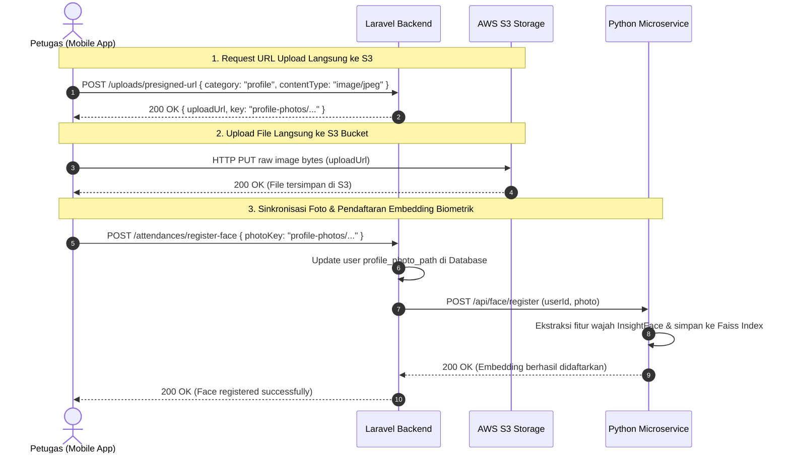
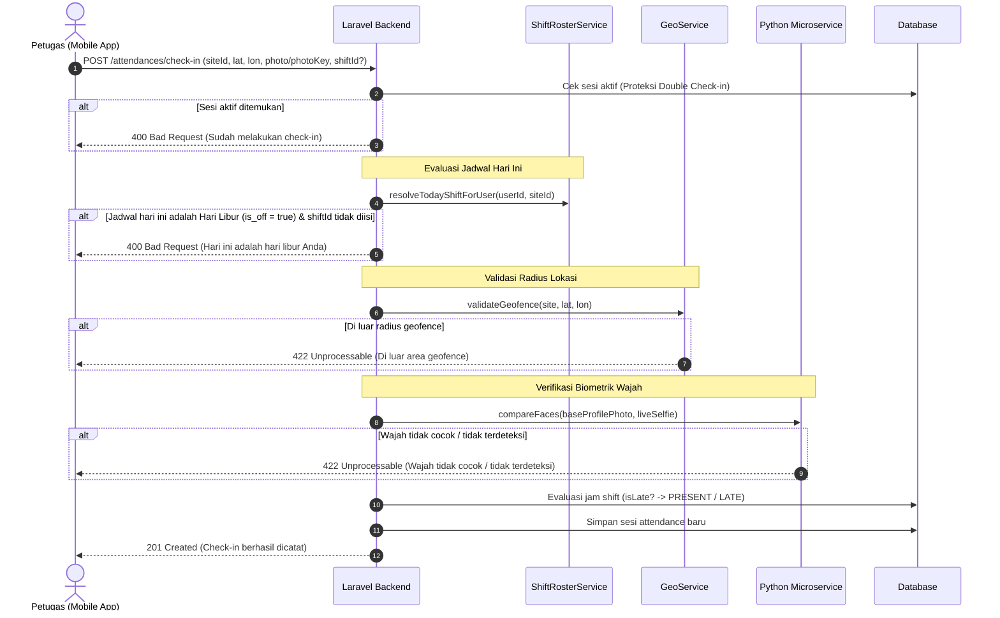
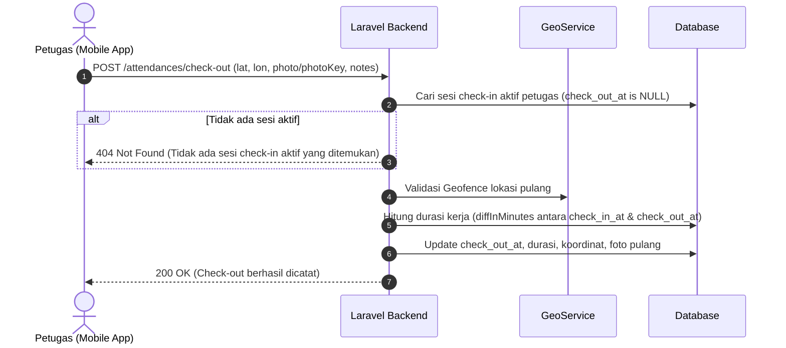

# Dokumentasi Teknis API: Fitur Absensi (Clock-In & Clock-Out) & Manajemen Shift
### GuardSync Backend API — Multi-Platform (Mobile Flutter & Web Command Centre)

Dokumen ini merupakan panduan teknis lengkap integrasi fitur **Absensi (Clock-In / Clock-Out)**, **Verifikasi Wajah Biometrik (Face Recognition)**, dan **Manajemen Giliran Shift Kerja (Shift Rotation Roster & Hari Libur)** pada GuardSync.

---

## 1. Arsitektur & Gambaran Umum

Fitur absensi GuardSync dirancang untuk menjamin validitas kehadiran Petugas Keamanan (Officer) di pos jaga masing-masing melalui 4 pilar validasi utama:
1. **Validasi Geofencing**: Memastikan petugas berada dalam radius situs/pos jaga (`radius_meters`) menggunakan koordinat GPS realtime perangkat via `GeoService` (Haversine).
2. **Verifikasi Biometrik Wajah (1:1 Face Matching)**: Menggunakan kecerdasan buatan InsightFace (`buffalo_l`) pada microservice `BE-FaceRecognition` untuk memvalidasi bahwa foto selfie saat check-in cocok dengan foto profil terdaftar.
3. **Pola Giliran Shift Siklik (Cyclic Shift Rotation)**: Menggunakan `ShiftRosterService` dengan aritmatika modulo untuk menghitung giliran shift berulang tak terbatas (*infinite sequence*) secara otomatis, seperti pola satpam standar: **2 Pagi, 2 Malam, 2 Libur**.
4. **Proteksi Hari Libur & Jam Dinas**: Mendeteksi jika hari ini adalah hari libur (`DEFAULT_OFF_DAY` / `is_off: true`) untuk mencegah check-in tanpa izin dinas, serta mengaitkan jam check-in dengan toleransi keterlambatan (`PRESENT` vs `LATE`).

```
+---------------------------------------------------------------------------------------+
|                                    ARSITEKTUR FITUR                                   |
+---------------------------------------------------------------------------------------+
|                                                                                       |
|   [ Mobile App Flutter ]                                                              |
|        |                                                                              |
|        |-- 1. Direct Pre-signed Upload / Multipart File                               |
|        v                                                                              |
|   [ AWS S3 Storage ] <----------------------------------------+                       |
|        |                                                      |                       |
|        |-- Photo Key / Public URL                             | Simpan selfie         |
|        v                                                      | & foto profil         |
|   [ Laravel Backend API ] ------------------------------------+                       |
|        |                                                                              |
|        |-- 2. Modulo Shift Roster (ShiftRosterService)                                |
|        |      - Menghitung shift kalender hari ini (Pagi / Malam / Libur)             |
|        |      - Menolak check-in jika hari Libur (kecuali override shift dinas)       |
|        |                                                                              |
|        |-- 3. Validasi Geofence (Haversine GeoService)                                |
|        |-- 4. Verifikasi Biometrik 1:1 (FaceRecognitionService)                       |
|        |      |                                                                       |
|        |      v                                                                       |
|        |   [ Python Microservice (FastAPI + InsightFace + Faiss) ]                    |
|        |      - POST /api/compare                                                     |
|        |      - POST /api/face/register                                               |
|        |                                                                              |
|        |-- 5. Kalkulasi Shift & Toleransi Keterlambatan (Shift::isLate)               |
|        v                                                                              |
|   [ PostgreSQL Database ]                                                             |
|        - attendances (Data sesi & log kehadiran)                                      |
|        - shifts (Master shift dinas & hari libur dengan flag is_off)                  |
|        - site_assignments (Konfigurasi shift_pattern & pattern_start_date)            |
|                                                                                       |
+---------------------------------------------------------------------------------------+
```

---

## 2. Alur Pengguna (User Flow)

### Flow 1: Pendaftaran Wajah Biometrik (Face Registration)
Sebelum dapat melakukan check-in dengan verifikasi wajah, petugas wajib memiliki foto profil acuan yang terdaftar di microservice biometrik.

Flow pendaftaran wajah mendukung **2 metode**:
1. **Metode Utama (Direct AWS S3 Pre-signed URL — Direkomendasikan)**:
   - **Step 1**: Klien meminta Presigned URL ke `POST /uploads/presigned-url` dengan `category: "profile"`.
   - **Step 2**: Klien mengunggah byte foto mentah secara langsung ke AWS S3 via `HTTP PUT <uploadUrl>`.
   - **Step 3**: Klien memanggil `POST /attendances/register-face` dengan mengirimkan `{ photoKey: "..." }`. Backend menyinkronkan foto profil dan mendaftarkan embedding biometrik ke microservice Python.
2. **Metode Alternatif (Direct Multipart Upload)**:
   - Klien langsung mengunggah file gambar via multipart form-data (`photo`) ke `POST /attendances/register-face`.



---

### Flow 2: Clock-In (Absen Masuk) & Validasi Hari Libur
Petugas memulai dinas jaga di situs penugasan. Sistem mengevaluasi jadwal shift kalender hari ini berdasarkan pola giliran siklik petugas.



---

### Flow 3: Clock-Out (Absen Pulang)
Petugas mengakhiri dinas jaga dan menutup sesi kehadiran aktif.



---

### Flow 4: Shift Lintas Hari / Overnight (Kasus `DEFAULT_SHIFT_MALAM`)
Untuk shift yang melintasi tengah malam (misal 19:00 WIB s.d 07:00 WIB H+1):
1. **Penentuan Status Lintas Hari**: Backend menandai `isOvernight = true` secara otomatis jika `start_time > end_time`.
2. **Keterlambatan Dini Hari**: Jika petugas baru check-in jam 00:30 WIB (tanggal berikutnya), sistem tetap menghitung keterlambatan terhadap jam mulai shift kemarin (19:00 WIB) sehingga statusnya dicatat secara akurat sebagai `LATE`.
3. **Check-Out Hari Esoknya**: Petugas check-out jam 07:00 WIB pada H+1. Sistem menghitung durasi akurat sebesar 720 menit (12 jam) tanpa terpengaruh pergantian tanggal kalender.

---

### Flow 5: Penanganan Hari Libur & Lembur / Tukar Shift (*Overtime Override*)
1. **Kasus Normal (Petugas Libur)**:
   - Petugas membuka aplikasi mobile, `GET /attendances/status` atau `GET /auth/me` mengembalikan `isOffDay: true` dan `todayShift: { "code": "DEFAULT_OFF_DAY", "name": "Libur / Off", "isOff": true }`.
   - Tombol check-in utama di mobile app menampilkan status *"Hari ini Jadwal Libur"* atau didisable.
   - Jika petugas tetap memaksakan check-in tanpa memilih shift kerja pengganti, backend menolak dengan error `400` bertuliskan *"Hari ini adalah hari libur Anda"*.
2. **Kasus Lembur / Tukar Shift (*Overtime*)**:
   - Jika petugas masuk lembur atau menggantikan rekan dinas lain, petugas memilih shift kerja pengganti (misal: `Shift Pagi` / `DEFAULT_SHIFT_PAGI`) pada form check-in.
   - Aplikasi mobile menyertakan parameter `shiftId: "<shift-uuid>"` pada `POST /attendances/check-in`.
   - Backend memprioritaskan `shiftId` eksplisit tersebut, melewati proteksi hari libur, dan mencatat absensi dinas secara sah.

---

## 3. Ringkasan Endpoint

Semua endpoint dilindungi oleh middleware `auth.jwt`. Header wajib:
```http
Authorization: Bearer <token>
Accept: application/json
Accept-Language: id   # (atau 'en' untuk Bahasa Inggris)
```

### A. Modul Shift Kerja (`/shifts`)
| Method | Endpoint | Role | Deskripsi |
| :--- | :--- | :--- | :--- |
| `GET` | `/shifts` | Semua Role | Daftar shift kerja (global & spesifik site). |
| `GET` | `/shifts/my-schedule` | Semua Role | Jadwal giliran shift berulang petugas (pagi, malam, libur). |
| `GET` | `/shifts/roster` | `SUPER_ADMIN`, `ADMIN`, `SUPERVISOR` | Rekap jadwal giliran shift seluruh petugas pada sebuah site. |
| `GET` | `/shifts/{id}` | Semua Role | Detail shift berdasarkan ID. |
| `POST` | `/shifts` | `SUPER_ADMIN`, `ADMIN` | Membuat master shift baru (mendukung flag `isOff`). |
| `PATCH` | `/shifts/{id}` | `SUPER_ADMIN`, `ADMIN` | Memperbarui data shift kerja (termasuk flag `isOff`). |
| `DELETE` | `/shifts/{id}` | `SUPER_ADMIN`, `ADMIN` | Menghapus shift kerja. |

### B. Modul Absensi Petugas (`/attendances`)
| Method | Endpoint | Role | Deskripsi |
| :--- | :--- | :--- | :--- |
| `POST` | `/attendances/register-face` | Semua Role | Registrasi wajah biometrik ke microservice. |
| `POST` | `/attendances/check-in` | `OFFICER`, `SUPERVISOR` | Absen masuk dengan GPS, verifikasi wajah & proteksi libur. |
| `POST` | `/attendances/check-out` | `OFFICER`, `SUPERVISOR` | Absen pulang dengan GPS & foto selfie. |
| `GET` | `/attendances/status` | Semua Role | Cek status sesi aktif, `todayShift`, dan flag `isOffDay`. |
| `GET` | `/attendances/my-history` | Semua Role | Riwayat absensi diri sendiri (terpaginasi). |

### C. Modul Monitoring & Command Centre (`/attendances`)
| Method | Endpoint | Role | Deskripsi |
| :--- | :--- | :--- | :--- |
| `GET` | `/attendances` | `SUPER_ADMIN`, `ADMIN`, `SUPERVISOR` | Monitoring seluruh kehadiran (Filter & Pagination). |
| `GET` | `/attendances/summary` | `SUPER_ADMIN`, `ADMIN`, `SUPERVISOR` | Ringkasan statistik kehadiran harian/periode. |
| `GET` | `/attendances/{id}` | `SUPER_ADMIN`, `ADMIN`, `SUPERVISOR` | Detail absensi petugas & foto bukti. |
| `PATCH` | `/attendances/{id}/adjust` | `SUPER_ADMIN`, `ADMIN`, `SUPERVISOR` | Koreksi manual status kehadiran oleh atasan. |
| `GET` | `/attendances/export` | `SUPER_ADMIN`, `ADMIN`, `SUPERVISOR` | Ekspor rekap kehadiran ke format CSV. |

### D. Modul Penugasan Situs & Pola Shift (`/sites`)
| Method | Endpoint | Role | Deskripsi |
| :--- | :--- | :--- | :--- |
| `POST` | `/sites/{siteId}/officers` | `SUPER_ADMIN`, `ADMIN` | Menugaskan petugas ke site beserta pola rotasi shift (`shiftPattern`, `patternStartDate`). |
| `GET` | `/sites/{siteId}/officers` | `SUPER_ADMIN`, `ADMIN`, `SUPERVISOR` | Daftar petugas di site beserta `todayShift`, `shiftPattern`, `isOffDay`. |

---

## 4. Spesifikasi Lengkap Request & Response

---

### 4.1 Registrasi Wajah Biometrik
Digunakan untuk mendaftarkan foto profil acuan agar siap digunakan untuk verifikasi wajah saat check-in.

* **Endpoint**: `POST /attendances/register-face`
* **Content-Type**: `multipart/form-data` ATAU `application/json`

#### Alur Pendaftaran Wajah (Dua Opsi):

##### Opsi 1: Direct AWS S3 Pre-signed URL (Direkomendasikan)
1. **Langkah 1: Request Presigned URL ke Backend**
   - **Endpoint**: `POST /uploads/presigned-url`
   - **Headers**: `Authorization: Bearer <token>`, `Content-Type: application/json`
   - **Request Body**:
     ```json
     {
       "category": "profile",
       "contentType": "image/jpeg",
       "fileName": "avatar.jpg"
     }
     ```
   - **Response (`200 OK`)**:
     ```json
     {
       "success": true,
       "message": "URL unggah sementara berhasil dibuat",
       "data": {
         "uploadUrl": "https://guardsync-assets.s3.ap-southeast-1.amazonaws.com/profile-photos/user-uuid/image.jpg?X-Amz-...",
         "key": "profile-photos/user-uuid/image.jpg",
         "publicUrl": "https://guardsync-assets.syntherion.co.id/profile-photos/user-uuid/image.jpg",
         "method": "PUT",
         "headers": {
           "Content-Type": "image/jpeg"
         }
       }
     }
     ```
2. **Langkah 2: Upload File Mentah Langsung ke AWS S3**
   - **Method**: `PUT` ke `uploadUrl` yang didapat dari Langkah 1
   - **Headers**: `Content-Type: image/jpeg`
   - **Body**: *Raw binary image bytes* (Progress upload dapat dipantau langsung di Flutter/Web)
   - **Response S3**: `200 OK`

3. **Langkah 3: Daftarkan Wajah ke GuardSync API**
   - **Endpoint**: `POST /attendances/register-face`
   - **Content-Type**: `application/json`
   - **Request Body**:
     ```json
     {
       "photoKey": "profile-photos/user-uuid/image.jpg"
     }
     ```
     > *(Supervisor/Admin dapat menambahkan `"userId": "target-user-uuid"` jika mendaftarkan foto untuk stafnya).*

##### Opsi 2: Direct Multipart Form-Data (Fallback)
Klien dapat langsung mengunggah file gambar ke backend dalam 1 request:
* **Endpoint**: `POST /attendances/register-face`
* **Content-Type**: `multipart/form-data`
* **Form Fields**:
  - `photo`: File gambar (JPEG, PNG, WEBP, maks 5 MB).
  - `userId`: *(Opsional)* UUID petugas target.

#### Parameter Request `POST /attendances/register-face`:
| Field | Tipe | Wajib | Keterangan |
| :--- | :--- | :--- | :--- |
| `photoKey` | String | Ya (jika Opsi 1) | Key S3 hasil upload presigned. |
| `photo` | File (image) | Ya (jika Opsi 2) | File gambar wajah langsung (JPEG, PNG, WEBP, maks 5 MB). |
| `userId` | UUID | Opsional | ID Petugas target. Hanya boleh diisi oleh `SUPER_ADMIN`, `ADMIN`, atau `SUPERVISOR`. Default: ID diri sendiri. |

#### Contoh Response Sukses (`200 OK`):
```json
{
  "success": true,
  "message": "Wajah berhasil didaftarkan",
  "data": {
    "userId": "9d35a58a-36b0-4cfa-811c-d760775d7101",
    "name": "Budi Santoso",
    "profilePhotoUrl": "https://storage.guardsync.com/profile-photos/9d35a58a-.../photo.jpg",
    "registered": true
  }
}
```

---

### 4.2 Clock-In (Absen Masuk)
Mencatat kehadiran masuk petugas dengan memvalidasi geofence, pencocokan biometrik wajah 1:1, dan evaluasi hari libur / shift kerja.

* **Endpoint**: `POST /attendances/check-in`
* **Content-Type**: `multipart/form-data` ATAU `application/json`

#### Request Body:
| Field | Tipe | Wajib | Keterangan |
| :--- | :--- | :--- | :--- |
| `siteId` | UUID | Ya | ID Situs penugasan tempat petugas berdinas. |
| `latitude` | Float | Ya | Garis lintang GPS perangkat (antara -90 s.d 90). |
| `longitude` | Float | Ya | Garis bujur GPS perangkat (antara -180 s.d 180). |
| `photo` | File (image) | Ya (jika tanpa `photoKey`) | Foto selfie realtime saat check-in (maks 10 MB). |
| `photoKey` | String | Ya (jika tanpa `photo`) | S3 storage key foto selfie hasil upload presigned. |
| `shiftId` | UUID | Opsional | ID Shift kerja pengganti/lembur. Jika kosong, sistem otomatis menghitung shift dari siklus pola rotasi petugas hari ini. |
| `notes` | String | Opsional | Catatan tambahan check-in (maks 500 karakter). |

#### Contoh Response Sukses (`201 Created`):
```json
{
  "success": true,
  "message": "Check-in berhasil dicatat",
  "data": {
    "id": "7c8e9b1a-4d2f-41e8-a1b9-8c9012345678",
    "userId": "9d35a58a-36b0-4cfa-811c-d760775d7101",
    "user": {
      "id": "9d35a58a-36b0-4cfa-811c-d760775d7101",
      "name": "Budi Santoso",
      "employeeId": "OF001",
      "profilePhotoUrl": "https://storage.guardsync.com/profile-photos/..."
    },
    "siteId": "8f12a34b-5c6d-47e8-b9a0-123456789abc",
    "site": {
      "id": "8f12a34b-5c6d-47e8-b9a0-123456789abc",
      "name": "Head Office Sudirman",
      "code": "SITE-JKT01"
    },
    "shiftId": "6a4b3c2d-1e0f-4a9b-8c7d-9876543210fe",
    "shift": {
      "id": "6a4b3c2d-1e0f-4a9b-8c7d-9876543210fe",
      "code": "DEFAULT_SHIFT_PAGI",
      "name": "Shift Pagi",
      "startTime": "07:00:00",
      "endTime": "19:00:00",
      "lateToleranceMinutes": 15,
      "isOvernight": false,
      "isOff": false
    },
    "date": "2026-10-01",
    "checkInAt": "2026-10-01T06:55:00.000000Z",
    "checkInLat": -6.2088,
    "checkInLon": 106.8456,
    "checkInPhotoUrl": "https://storage.guardsync.com/attendance-photos/SITE-JKT01/checkin-123.jpg",
    "checkInFaceMatch": true,
    "checkInFaceConfidence": 0.88,
    "checkInDistanceMeters": 12.5,
    "checkInNotes": "Kondisi pos aman",
    "checkOutAt": null,
    "checkOutLat": null,
    "checkOutLon": null,
    "checkOutPhotoUrl": null,
    "checkOutDistanceMeters": null,
    "checkOutNotes": null,
    "durationMinutes": null,
    "status": "PRESENT",
    "reviewedBy": null,
    "reviewNotes": null,
    "createdAt": "2026-10-01T06:55:00.000000Z",
    "updatedAt": "2026-10-01T06:55:00.000000Z"
  }
}
```

#### Respon Penolakan Saat Petugas Terjadwal LIBUR (`400 Bad Request`):
Jika hari ini adalah hari libur petugas dalam siklus rotasi dan request tidak menyertakan `shiftId` kerja pengganti:
```json
{
  "success": false,
  "message": "Hari ini adalah hari libur Anda",
  "data": null
}
```
*(Dalam header `Accept-Language: en`, pesan menjadi: `"Today is your day off"`)*.

---

### 4.3 Clock-Out (Absen Pulang)
Mengakhiri dinas aktif, mencatat bukti foto & posisi pulang, serta menghitung total jam kerja.

* **Endpoint**: `POST /attendances/check-out`
* **Content-Type**: `multipart/form-data` ATAU `application/json`

#### Request Body:
| Field | Tipe | Wajib | Keterangan |
| :--- | :--- | :--- | :--- |
| `latitude` | Float | Ya | Koordinat lintang saat pulang. |
| `longitude` | Float | Ya | Koordinat bujur saat pulang. |
| `photo` | File (image) | Ya (jika tanpa `photoKey`) | Foto selfie bukti kepulangan. |
| `photoKey` | String | Ya (jika tanpa `photo`) | S3 storage key foto pulang. |
| `notes` | String | Opsional | Catatan serah terima pos / kepulangan. |

#### Contoh Response Sukses (`200 OK`):
```json
{
  "success": true,
  "message": "Check-out berhasil dicatat",
  "data": {
    "id": "7c8e9b1a-4d2f-41e8-a1b9-8c9012345678",
    "checkInAt": "2026-10-01T06:55:00.000000Z",
    "checkOutAt": "2026-10-01T19:05:00.000000Z",
    "checkOutLat": -6.2089,
    "checkOutLon": 106.8457,
    "checkOutPhotoUrl": "https://storage.guardsync.com/attendance-photos/SITE-JKT01/checkout-123.jpg",
    "checkOutDistanceMeters": 14.2,
    "checkOutNotes": "Serah terima inventaris pos lengkap ke Shift Malam",
    "durationMinutes": 730,
    "status": "PRESENT"
  }
}
```

---

### 4.4 Status Kehadiran & Jadwal Hari Ini
Mengecek apakah petugas memiliki sesi check-in yang sedang berjalan, serta mengembalikan detail **shift kerja hari ini** (`todayShift`) dan status hari libur (`isOffDay`).

* **Endpoint**: `GET /attendances/status`

#### Contoh Response 1: Petugas Sedang Dinas Aktif (`200 OK`):
```json
{
  "success": true,
  "message": "Status absensi berhasil diambil",
  "data": {
    "isCheckedIn": true,
    "activeAttendance": {
      "id": "7c8e9b1a-4d2f-41e8-a1b9-8c9012345678",
      "site": {
        "id": "8f12a34b-5c6d-47e8-b9a0-123456789abc",
        "name": "Head Office Sudirman"
      },
      "shift": {
        "id": "6a4b3c2d-1e0f-4a9b-8c7d-9876543210fe",
        "name": "Shift Pagi"
      },
      "checkInAt": "2026-10-01T06:55:00.000000Z",
      "status": "PRESENT"
    },
    "todayShift": {
      "id": "6a4b3c2d-1e0f-4a9b-8c7d-9876543210fe",
      "code": "DEFAULT_SHIFT_PAGI",
      "name": "Shift Pagi",
      "startTime": "07:00:00",
      "endTime": "19:00:00",
      "lateToleranceMinutes": 15,
      "isOvernight": false,
      "isOff": false
    },
    "isOffDay": false
  }
}
```

#### Contoh Response 2: Petugas Sedang Terjadwal LIBUR (`200 OK`):
```json
{
  "success": true,
  "message": "Status absensi berhasil diambil",
  "data": {
    "isCheckedIn": false,
    "activeAttendance": null,
    "todayShift": {
      "id": "3c2d1e0f-9a8b-4c7d-6e5f-123456789abc",
      "code": "DEFAULT_OFF_DAY",
      "name": "Libur / Off",
      "startTime": null,
      "endTime": null,
      "lateToleranceMinutes": 0,
      "isOvernight": false,
      "isOff": true
    },
    "isOffDay": true
  }
}
```

---

### 4.5 Jadwal Giliran Shift Pribadi Petugas (`/shifts/my-schedule`)
Mendapatkan kalender giliran shift berulang milik petugas yang sedang login untuk rentang hari tertentu (misal: 14 hari ke depan).

* **Endpoint**: `GET /shifts/my-schedule`
* **Query Parameters**:
  - `siteId`: *(Opsional)* UUID site penugasan spesifik (default: penugasan primer petugas).
  - `startDate`: *(Opsional)* Mulai tanggal (`YYYY-MM-DD`, default: hari ini).
  - `endDate`: *(Opsional)* Akhir tanggal (`YYYY-MM-DD`).
  - `days`: *(Opsional)* Jumlah hari dari startDate (default: `14`).

#### Contoh Response Sukses (`200 OK`):
```json
{
  "success": true,
  "message": "Jadwal shift berhasil diambil",
  "data": {
    "site": {
      "id": "8f12a34b-5c6d-47e8-b9a0-123456789abc",
      "name": "Head Office Sudirman",
      "code": "SITE-JKT01"
    },
    "shiftPattern": [
      "DEFAULT_SHIFT_PAGI",
      "DEFAULT_SHIFT_PAGI",
      "DEFAULT_SHIFT_MALAM",
      "DEFAULT_SHIFT_MALAM",
      "DEFAULT_OFF_DAY",
      "DEFAULT_OFF_DAY"
    ],
    "patternStartDate": "2026-10-01",
    "schedule": [
      {
        "date": "2026-10-01",
        "dayOfWeek": "Kamis",
        "isOffDay": false,
        "shift": {
          "id": "6a4b3c2d-1e0f-4a9b-8c7d-9876543210fe",
          "code": "DEFAULT_SHIFT_PAGI",
          "name": "Shift Pagi",
          "startTime": "07:00:00",
          "endTime": "19:00:00",
          "lateToleranceMinutes": 15,
          "isOvernight": false,
          "isOff": false
        }
      },
      {
        "date": "2026-10-02",
        "dayOfWeek": "Jumat",
        "isOffDay": false,
        "shift": {
          "id": "6a4b3c2d-1e0f-4a9b-8c7d-9876543210fe",
          "code": "DEFAULT_SHIFT_PAGI",
          "name": "Shift Pagi",
          "startTime": "07:00:00",
          "endTime": "19:00:00",
          "lateToleranceMinutes": 15,
          "isOvernight": false,
          "isOff": false
        }
      },
      {
        "date": "2026-10-03",
        "dayOfWeek": "Sabtu",
        "isOffDay": false,
        "shift": {
          "id": "7b5c4d3e-2f1a-5b0c-9d8e-0987654321ba",
          "code": "DEFAULT_SHIFT_MALAM",
          "name": "Shift Malam",
          "startTime": "19:00:00",
          "endTime": "07:00:00",
          "lateToleranceMinutes": 15,
          "isOvernight": true,
          "isOff": false
        }
      },
      {
        "date": "2026-10-04",
        "dayOfWeek": "Minggu",
        "isOffDay": false,
        "shift": {
          "id": "7b5c4d3e-2f1a-5b0c-9d8e-0987654321ba",
          "code": "DEFAULT_SHIFT_MALAM",
          "name": "Shift Malam",
          "startTime": "19:00:00",
          "endTime": "07:00:00",
          "lateToleranceMinutes": 15,
          "isOvernight": true,
          "isOff": false
        }
      },
      {
        "date": "2026-10-05",
        "dayOfWeek": "Senin",
        "isOffDay": true,
        "shift": {
          "id": "8c6d5e4f-3a2b-6c1d-0e9f-112233445566",
          "code": "DEFAULT_OFF_DAY",
          "name": "Libur / Off",
          "startTime": null,
          "endTime": null,
          "lateToleranceMinutes": 0,
          "isOvernight": false,
          "isOff": true
        }
      },
      {
        "date": "2026-10-06",
        "dayOfWeek": "Selasa",
        "isOffDay": true,
        "shift": {
          "id": "8c6d5e4f-3a2b-6c1d-0e9f-112233445566",
          "code": "DEFAULT_OFF_DAY",
          "name": "Libur / Off",
          "startTime": null,
          "endTime": null,
          "lateToleranceMinutes": 0,
          "isOvernight": false,
          "isOff": true
        }
      }
    ]
  }
}
```

---

### 4.6 Rekap Roster Giliran Shift Situs (`/shifts/roster`)
Digunakan oleh Supervisor dan Admin untuk melihat matriks giliran shift seluruh petugas pada pos jaga tertentu.

* **Endpoint**: `GET /shifts/roster`
* **Role**: `SUPER_ADMIN`, `ADMIN`, `SUPERVISOR`
* **Query Parameters**:
  - `siteId`: *(Wajib)* UUID site penugasan.
  - `startDate`: *(Opsional)* Tanggal awal periode (default: hari ini).
  - `endDate`: *(Opsional)* Tanggal akhir periode.
  - `days`: *(Opsional)* Jumlah hari (default: `7`).

#### Contoh Response Sukses (`200 OK`):
```json
{
  "success": true,
  "message": "Jadwal giliran shift berhasil diambil",
  "data": {
    "siteId": "8f12a34b-5c6d-47e8-b9a0-123456789abc",
    "startDate": "2026-10-01",
    "endDate": "2026-10-07",
    "roster": [
      {
        "assignmentId": "1a2b3c4d-...",
        "user": {
          "id": "9d35a58a-36b0-4cfa-811c-d760775d7101",
          "name": "Budi Santoso (Regu A)",
          "employeeId": "OF001"
        },
        "shiftPattern": ["DEFAULT_SHIFT_PAGI", "DEFAULT_SHIFT_PAGI", "DEFAULT_SHIFT_MALAM", "DEFAULT_SHIFT_MALAM", "DEFAULT_OFF_DAY", "DEFAULT_OFF_DAY"],
        "patternStartDate": "2026-10-01",
        "schedule": [
          { "date": "2026-10-01", "isOffDay": false, "shift": { "code": "DEFAULT_SHIFT_PAGI" } },
          { "date": "2026-10-02", "isOffDay": false, "shift": { "code": "DEFAULT_SHIFT_PAGI" } },
          { "date": "2026-10-03", "isOffDay": false, "shift": { "code": "DEFAULT_SHIFT_MALAM" } },
          { "date": "2026-10-04", "isOffDay": false, "shift": { "code": "DEFAULT_SHIFT_MALAM" } },
          { "date": "2026-10-05", "isOffDay": true, "shift": { "code": "DEFAULT_OFF_DAY" } },
          { "date": "2026-10-06", "isOffDay": true, "shift": { "code": "DEFAULT_OFF_DAY" } },
          { "date": "2026-10-07", "isOffDay": false, "shift": { "code": "DEFAULT_SHIFT_PAGI" } }
        ]
      },
      {
        "assignmentId": "2b3c4d5e-...",
        "user": {
          "id": "8c24a47a-25a0-4bfa-700b-c650664c6002",
          "name": "Siti Rahma (Regu B)",
          "employeeId": "OF002"
        },
        "shiftPattern": ["DEFAULT_SHIFT_PAGI", "DEFAULT_SHIFT_PAGI", "DEFAULT_SHIFT_MALAM", "DEFAULT_SHIFT_MALAM", "DEFAULT_OFF_DAY", "DEFAULT_OFF_DAY"],
        "patternStartDate": "2026-09-29",
        "schedule": [
          { "date": "2026-10-01", "isOffDay": false, "shift": { "code": "DEFAULT_SHIFT_MALAM" } },
          { "date": "2026-10-02", "isOffDay": false, "shift": { "code": "DEFAULT_SHIFT_MALAM" } },
          { "date": "2026-10-03", "isOffDay": true, "shift": { "code": "DEFAULT_OFF_DAY" } },
          { "date": "2026-10-04", "isOffDay": true, "shift": { "code": "DEFAULT_OFF_DAY" } },
          { "date": "2026-10-05", "isOffDay": false, "shift": { "code": "DEFAULT_SHIFT_PAGI" } },
          { "date": "2026-10-06", "isOffDay": false, "shift": { "code": "DEFAULT_SHIFT_PAGI" } },
          { "date": "2026-10-07", "isOffDay": false, "shift": { "code": "DEFAULT_SHIFT_MALAM" } }
        ]
      }
    ]
  }
}
```

---

### 4.7 Master Shift Kerja (`POST /shifts` & `PATCH /shifts/{id}`)

#### A. Buat Master Shift Baru (Mendukung Hari Libur / Off)
* **Endpoint**: `POST /shifts`
* **Role**: `SUPER_ADMIN`, `ADMIN`
* **Headers**: `Content-Type: application/json`

**Contoh 1: Membuat Shift Jam Kerja Biasa**:
```json
{
  "siteId": "8f12a34b-5c6d-47e8-b9a0-123456789abc",
  "code": "SHIFT_SORE",
  "name": "Shift Sore",
  "startTime": "15:00:00",
  "endTime": "23:00:00",
  "lateToleranceMinutes": 15,
  "isOff": false
}
```

**Contoh 2: Membuat Shift Libur / Off (Jam Tidak Wajib Diisi)**:
```json
{
  "code": "CUSTOM_OFF_DAY",
  "name": "Libur Mingguan Pos Tambang",
  "isOff": true
}
```

---

### 4.8 Penugasan Petugas ke Pos Jaga (`POST /sites/{siteId}/officers`)
Admin menetapkan petugas ke pos jaga dan dapat langsung menyetel pola rotasi shift siklik serta tanggal mulai siklusnya.

* **Endpoint**: `POST /sites/{siteId}/officers`
* **Role**: `SUPER_ADMIN`, `ADMIN`
* **Request Body**:
```json
{
  "userId": "9d35a58a-36b0-4cfa-811c-d760775d7101",
  "primary": true,
  "shiftPattern": [
    "DEFAULT_SHIFT_PAGI",
    "DEFAULT_SHIFT_PAGI",
    "DEFAULT_SHIFT_MALAM",
    "DEFAULT_SHIFT_MALAM",
    "DEFAULT_OFF_DAY",
    "DEFAULT_OFF_DAY"
  ],
  "patternStartDate": "2026-10-01"
}
```

---

## 5. Kamus Status & Error Response

### Status Kehadiran (`AttendanceStatus`):
| Status | Label | Penjelasan |
| :--- | :--- | :--- |
| `PRESENT` | Hadir Tepat Waktu | Check-in dilakukan sebelum `start_time` + toleransi keterlambatan. |
| `LATE` | Hadir Terlambat | Check-in dilakukan setelah batas toleransi keterlambatan shift. |
| `LEAVE` | Izin / Cuti | Petugas tidak bertugas karena cuti yang telah disetujui. |
| `SICK` | Sakit | Petugas tidak bertugas dengan surat keterangan dokter. |
| `ALPHA` | Mangkir / Tanpa Keterangan | Tidak hadir tanpa laporan keterangan dinas. |

### Pesan Kesalahan Umum (Auto-Localized ID/EN):
| Kode HTTP | Pesan Bahasa Indonesia | Pesan Bahasa Inggris | Penyebab & Solusi |
| :---: | :--- | :--- | :--- |
| `400` | Hari ini adalah hari libur Anda | Today is your day off | Petugas terjadwal libur hari ini. Jika masuk lembur/tukar dinas, sertakan parameter `shiftId`. |
| `400` | Tidak dapat melakukan absensi pada hari libur | Cannot check in on an off day | Shift yang dipilih memiliki status libur (`is_off: true`). |
| `400` | Anda sudah memiliki sesi check-in aktif | Already checked in | Petugas memiliki sesi dinas yang belum di-check-out. Selesaikan sesi sebelumnya terlebih dahulu. |
| `400` | Tidak ada sesi check-in aktif yang ditemukan | No active check-in found | Petugas mencoba check-out tanpa melakukan check-in terlebih dahulu. |
| `400` | Foto profil referensi belum ada | Reference photo not found | Petugas belum mendaftarkan foto profil biometrik. Lakukan registrasi wajah terlebih dahulu. |
| `422` | Wajah tidak cocok dengan profil terdaftar | Face does not match registered profile | Wajah selfie tidak cocok dengan foto profil di InsightFace. Ambil foto di tempat terang tanpa penutup wajah. |
| `422` | Wajah tidak terdeteksi pada foto | No face detected in photo | Foto selfie gelap, blur, atau wajah tertutup masker/helm. |
| `422` | Lokasi berada di luar geofence | Outside geofence | Koordinat GPS petugas berjarak lebih jauh dari `radius_meters` site. Pastikan GPS akurat dan berada di pos jaga. |
| `403` | Akses situs ditolak | Site access denied | Petugas tidak memiliki penugasan aktif di situs tersebut (`SiteScope` violation). |
| `503` | Layanan pengenalan wajah sedang tidak tersedia | Face recognition service unavailable | Microservice Python `BE-FaceRecognition` offline atau mengalami timeout. |

---

## 6. Manajemen Pola Giliran Shift (Shift Rotation / Roster) & Hari Libur (Off Day)

### 6.1 Studi Kasus: Pola Giliran Satpam 2-2-2 (Pagi - Malam - Libur)
Di lapangan, jadwal satpam umumnya bergilir tanpa putus dalam pola siklus 6 hari:
```
[ DEFAULT_SHIFT_PAGI, DEFAULT_SHIFT_PAGI, DEFAULT_SHIFT_MALAM, DEFAULT_SHIFT_MALAM, DEFAULT_OFF_DAY, DEFAULT_OFF_DAY ]
```

| Siklus | Hari ke- | Shift | Jam Dinas | Keterangan |
| :---: | :---: | :--- | :---: | :--- |
| Hari 1 | Day 0 | `DEFAULT_SHIFT_PAGI` | 07:00 - 19:00 | Dinas Pagi Hari 1 |
| Hari 2 | Day 1 | `DEFAULT_SHIFT_PAGI` | 07:00 - 19:00 | Dinas Pagi Hari 2 |
| Hari 3 | Day 2 | `DEFAULT_SHIFT_MALAM` | 19:00 - 07:00 H+1 | Dinas Malam Hari 1 (Lintas hari) |
| Hari 4 | Day 3 | `DEFAULT_SHIFT_MALAM` | 19:00 - 07:00 H+1 | Dinas Malam Hari 2 (Lintas hari) |
| Hari 5 | Day 4 | `DEFAULT_OFF_DAY` | - | **LIBUR / OFF DAY** |
| Hari 6 | Day 5 | `DEFAULT_OFF_DAY` | - | **LIBUR / OFF DAY** |
| Hari 7 | Day 6 | `DEFAULT_SHIFT_PAGI` | 07:00 - 19:00 | **Siklus kembali ke awal secara otomatis!** |

---

### 6.2 Aritmatika Modulo & Pengaturan Multi-Regu (Regu A, Regu B, Regu C)

Untuk pos jaga 24 jam dengan 3 regu satpam, pos jaga tidak boleh kosong. Kita cukup menggeser tanggal acuan (`patternStartDate`) masing-masing regu sebanyak 2 hari:

Contoh konfigurasi `patternStartDate` di pos jaga:
- **Regu A**: `patternStartDate = 2026-10-01` (Memulai hari ini dengan **Shift Pagi**)
- **Regu B**: `patternStartDate = 2026-09-29` (Hari ini berada pada siklus Day 2 -> **Shift Malam**)
- **Regu C**: `patternStartDate = 2026-09-27` (Hari ini berada pada siklus Day 4 -> **LIBUR**)

**Matriks Kehadiran Harian**:
```
+-------------+---------------+---------------+---------------+
| Tanggal     | Regu A        | Regu B        | Regu C        |
+-------------+---------------+---------------+---------------+
| 2026-10-01  | Pagi (Day 0)  | Malam (Day 2) | Libur (Day 4) |
| 2026-10-02  | Pagi (Day 1)  | Malam (Day 3) | Libur (Day 5) |
| 2026-10-03  | Malam (Day 2) | Libur (Day 4) | Pagi (Day 0)  |
| 2026-10-04  | Malam (Day 3) | Libur (Day 5) | Pagi (Day 1)  |
| 2026-10-05  | Libur (Day 4) | Pagi (Day 0)  | Malam (Day 2) |
| 2026-10-06  | Libur (Day 5) | Pagi (Day 1)  | Malam (Day 3) |
| 2026-10-07  | Pagi (Day 0)  | Malam (Day 2) | Libur (Day 4) |
+-------------+---------------+---------------+---------------+
```
*(Pos jaga selalu terisi 24 jam penuh secara otomatis tanpa perlu input manual setiap minggu!)*

---

### 6.3 Panduan Implementasi UI/UX Mobile Flutter

1. **Dashboard Home (Sebelum Check-In)**:
   - Panggil `GET /attendances/status`.
   - Periksa `data.isOffDay`:
     - **Jika `false`**: Tampilkan kartu jadwal dinas hari ini (misal: *"Shift Pagi: 07:00 - 19:00"*) dan tombol hijau **"Check-In Sekarang"**.
     - **Jika `true`**: Tampilkan banner warna biru/abu-abu bertuliskan **"Hari ini Jadwal Libur Anda"** atau **"Selamat Beristirahat"**. Tombol check-in utama dapat diubah menjadi tombol sekunder bertuliskan **"Masuk Lembur / Tukar Shift"**.
2. **Saat Petugas Masuk Lembur / Tukar Shift**:
   - Jika petugas menekan tombol **"Masuk Lembur / Tukar Shift"**, tampilkan dialog pemilihan shift dinas yang tersedia (diambil dari `GET /shifts?siteId=...`).
   - Sertakan UUID shift yang dipilih ke parameter `shiftId` pada payload `POST /attendances/check-in`.
3. **Tab Kalender Roster**:
   - Tampilkan tab **"Jadwal Giliran Saya"** yang memanggil `GET /shifts/my-schedule?days=30`.
   - Render kalender dengan warna pembeda yang jelas:
     - 🟡 **Kuning**: Shift Pagi (`DEFAULT_SHIFT_PAGI`)
     - 🔵 **Biru Tua**: Shift Malam (`DEFAULT_SHIFT_MALAM`)
     - 🟢 **Hijau / Abu-abu**: Hari Libur (`DEFAULT_OFF_DAY`)
