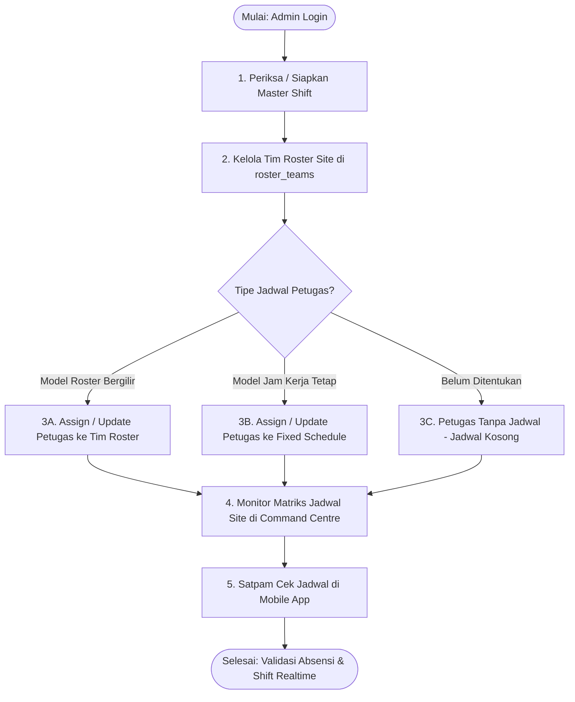

# Panduan Teknis & User Journey: Manajemen Shift Roster Tim & Jam Kerja Tetap (Fixed Schedule)
### GuardSync Backend API — Command Centre Admin & Mobile Satpam

Dokumen ini merupakan panduan teknis lengkap integrasi dan panduan alur pengguna (**User Journey**) bagi **Admin / Super Admin** dalam melakukan konfigurasi master shift, pembuatan pola shift tim (**Roster Teams**), penugasan petugas (**Assignment Officer**) ke dalam tim roster maupun jam kerja tetap (**Fixed Schedule**), serta konsumsi API oleh aplikasi mobile satpam.

---

## 1. Arsitektur & Konsep Utama

Sistem shift GuardSync menerapkan model penjadwalan fleksibel multi-site yang mendukung dua skenario kerja utama satpam di lapangan:

1. **Model Shift / Roster Bergilir Berbasis Tim (`ROSTER`)**:
   - Satpam dibagi ke dalam beberapa tim kerja (misal: Tim A, Tim B, Tim C, dsb).
   - Banyaknya tim per site bersifat dinamis (0, 2, 3, 4, 5+ tim) sesuai kebutuhan site.
   - Tiap tim memiliki pola perputaran (*cyclic shift pattern*) dan tanggal awal acuan (*anchor date*) yang independen.
   - Contoh pola 3 tim di satu site:
     - **Tim A**: Pagi, Pagi, Malam, Malam, Libur, Libur
     - **Tim B**: Malam, Malam, Libur, Libur, Pagi, Pagi
     - **Tim C**: Libur, Libur, Pagi, Pagi, Malam, Malam
   - Penjadwalan dihitung secara otomatis dan tak terbatas (*infinite sequence*) menggunakan **aritmatika modulo** kalender (`ShiftRosterService`).

2. **Model Jam Kerja Tetap / Non-Shift (`FIXED`)**:
   - Jam kerja harian teratur (misalnya jam 07:00 – 17:00 WIB sesuai kebijakan site).
   - Hari kerja dikustomisasi melalui array `workDays` (1 = Senin s/d 7 = Minggu, default: Senin–Jumat `[1, 2, 3, 4, 5]`).
   - Hari di luar `workDays` otomatis diidentifikasi sebagai hari libur dinas (`DEFAULT_OFF_DAY` / `is_off: true`).

3. **Status Satpam Tanpa Jadwal (Unassigned)**:
   - Jika petugas baru ditugaskan ke site tanpa menentukan `scheduleType` atau tim, jadwal ditampilkan **kosong** (`schedule: []`, `todayShift: null`, `scheduleType: null`).
   - Sistem **tidak akan** memaksa memasukkan petugas ke siklus default apapun sebelum Admin/Super Admin menetapkan jadwalnya.

4. **Kemandirian Tim Per Site (Tanpa Preset Palsu)**:
   - Jika suatu site belum pernah membuat tim kustom di tabel `roster_teams`, endpoint API mengembalikan array kosong `[]` (tidak ada preset bawaan yang dipaksakan).

---

### 1.1. Pembersihan & Penghapusan Kolom Database yang Tidak Relevan (Dropped Columns)

Sebagai bagian dari perombakan arsitektur menuju sistem multi-tim relasional dan penjadwalan dinamis, skema basis data telah dinormalisasi melalui migrasi [`2026_10_02_000002_reorganize_shift_and_roster_schedule_fields.php`](file:///Users/abdi/Documents/Personal%20Workspace/GuardSync/BE/database/migrations/2026_10_02_000002_reorganize_shift_and_roster_schedule_fields.php). Kolom-kolom lama berikut telah resmi **DIHAPUS (DROPPED)** dari database:

| Tabel Database | Kolom yang Dihapus | Tipe Data Asal | Alasan Penghapusan & Pengganti |
|---|---|---|---|
| `site_assignments` | `shift` | `VARCHAR` | **Dihapus total.** Kolom teks lama (seperti `'PAGI'`, `'MALAM'`) sudah usang dan bertabrakan nama (*name collision*) dengan method relasi Eloquent `public function shift(): BelongsTo`. Digantikan oleh kolom `schedule_type` (`ROSTER` / `FIXED`), `roster_team_id` (FK ke `roster_teams`), dan `shift_id` (FK ke `shifts`). |
| `sites` | `default_shift_pattern` | `JSON` | **Dihapus total.** Kolom pola JSON tunggal di tingkat site sudah tidak relevan karena sebuah site kini dapat memiliki jumlah tim dinamis (Tim A, Tim B, Tim C, dst) dengan pola dan jadwal perputaran yang berbeda-beda. Digantikan oleh tabel relasional khusus `roster_teams` di mana setiap tim menyimpan `shift_pattern` dan `pattern_start_date` masing-masing. |

> [!WARNING] Breaking Changes untuk Klien API (Mobile Flutter & Web Command Centre)
> 1. **Jangan mengirim properti `shift` lagi**: Pada request `POST /sites/{siteId}/officers` maupun `PATCH /sites/{siteId}/officers/{userId}`, properti `'shift': 'PAGI'` atau `'shift': 'MALAM'` sudah tidak berlaku. Gunakan `scheduleType: 'ROSTER'` dengan `rosterTeamId`, atau `scheduleType: 'FIXED'` dengan `shiftId`.
> 2. **Respon JSON tidak lagi memiliki string `assignment.shift`**: Properti `shift` pada objek assignment sekarang berupa objek relasi `Shift` terstruktur (atau `null` jika tidak ada `shiftId`), bukan lagi string kode mentah.
> 3. **Objek Site tidak lagi memiliki properti `defaultShiftPattern`**: Jangan lagi membaca `site.defaultShiftPattern`. Untuk mendapatkan daftar pola tim pada site, panggil endpoint `GET /sites/{siteId}/roster-teams` atau `GET /shifts/teams?siteId={siteId}`.

---

### 1.2. Diagram Skema Basis Data (ERD)

```
+---------------------------------------------------------------------------------------------------+
|                                      RELASI ENTITAS DATABASE                                      |
+---------------------------------------------------------------------------------------------------+
|                                                                                                   |
|    +-------------------+           1 : N           +-----------------------------+                |
|    |       sites       |-------------------------->|        roster_teams         |                |
|    |-------------------|                           |-----------------------------|                |
|    | id (UUID)         |                           | id (UUID)                   |                |
|    | code              |                           | site_id (FK -> sites.id)    |                |
|    | name              |                           | code (e.g. TIM-A)           |                |
|    +-------------------+                           | name (e.g. Tim Reguler Alpha)                |
|              |                                     | shift_pattern (JSON Array)  |                |
|              | 1 : N                               | pattern_start_date (DATE)   |                |
|              v                                     +-----------------------------+                |
|    +------------------------------------+                         |                               |
|    |          site_assignments          |<------------------------+ 1 : N                         |
|    |------------------------------------|  (roster_team_id)                                       |
|    | id (UUID)                          |                                                         |
|    | site_id (FK -> sites.id)           |                                                         |
|    | user_id (FK -> users.id)           |                                                         |
|    | schedule_type (ROSTER | FIXED)     |                                                         |
|    | roster_team_id (FK -> roster_teams)|                                                         |
|    | shift_id (FK -> shifts.id)         |                                                         |
|    | work_days (JSON Array [1..7])      |                                                         |
|    | primary (BOOLEAN)                  |                                                         |
|    +------------------------------------+                                                         |
|              |                                                                                    |
|              | N : 1                                                                              |
|              v                                                                                    |
|    +-------------------+                                                                          |
|    |      shifts       |                                                                          |
|    |-------------------|                                                                          |
|    | id (UUID)         |                                                                          |
|    | code              |                                                                          |
|    | name              |                                                                          |
|    | start_time        |                                                                          |
|    | end_time          |                                                                          |
|    | is_off (BOOLEAN)  |                                                                          |
|    +-------------------+                                                                          |
|                                                                                                   |
+---------------------------------------------------------------------------------------------------+
```

---

## 2. User Journey Flow Admin / Super Admin



### Tahapan Alur Pengguna (User Journey Steps)

#### Langkah 1: Memeriksa / Menyiapkan Master Shift
1. Admin memeriksa daftar master shift kerja yang tersedia di sistem melalui `GET /shifts`.
2. Sistem GuardSync telah menyediakan master shift bawaan global:
   - `DEFAULT_SHIFT_PAGI`: 07:00:00 – 15:00:00 WIB
   - `DEFAULT_SHIFT_SIANG`: 15:00:00 – 23:00:00 WIB
   - `DEFAULT_SHIFT_MALAM`: 23:00:00 – 07:00:00 WIB (Overnight crossing midnight)
   - `DEFAULT_SHIFT_NORMAL`: 07:00:00 – 17:00:00 WIB (Fixed work hours)
   - `DEFAULT_OFF_DAY`: Shift libur dinas (`is_off: true`)
3. Jika Site memiliki jam operasional kustom (contoh: Shift Khusus 06:00 – 18:00), Admin membuat shift kustom site melalui `POST /shifts` dengan menyertakan `siteId`.

#### Langkah 2: Membuat & Menentukan Pola Shift Tim (`roster_teams`)
1. Admin membuka halaman manajemen site pada Web Command Centre dan mengecek daftar tim via `GET /sites/{siteId}/roster-teams`. Jika site baru, daftar tim berstatus kosong `[]`.
2. Admin membuat tim-tim yang diperlukan sesuai kebutuhan site via `POST /sites/{siteId}/roster-teams`:
   - Menentukan `code` (misal: `TIM-A`) dan `name` (misal: `Tim Alpha Pos Barat`).
   - Menentukan urutan perputaran `shiftPattern` (array kode shift atau UUID shift).
   - Menentukan tanggal awal acuan perputaran `patternStartDate`.
3. Admin dapat mengulangi langkah ini untuk membuat Tim B, Tim C, Tim D, dst.

#### Langkah 3A: Menugaskan Petugas ke Tim Roster (`scheduleType: 'ROSTER'`)
1. Admin menugaskan satpam ke site tersebut dan langsung mengaitkannya ke salah satu tim:
   - Petugas Baru: `POST /sites/{siteId}/officers` dengan `scheduleType = 'ROSTER'` dan `rosterTeamId = '{uuid-team}'`.
   - Petugas Lama: `PATCH /sites/{siteId}/officers/{userId}` dengan `scheduleType = 'ROSTER'` dan `rosterTeamId = '{uuid-team}'`.
2. Secara otomatis seluruh petugas dalam tim tersebut akan berbagi jadwal perputaran yang identik dan tersinkronisasi.

#### Langkah 3B: Menugaskan Petugas ke Jam Kerja Tetap (`scheduleType: 'FIXED'`)
1. Untuk satpam/staf pos jaga yang memiliki jam kerja tetap non-shift:
   - Admin mengirimkan `scheduleType = 'FIXED'`.
   - Mengisi `shiftId` (merujuk ke shift jam kerja tetap, misal `DEFAULT_SHIFT_NORMAL` atau shift kustom 07:00 – 17:00).
   - Mengisi `workDays` dengan array angka hari kerja (contoh: `[1, 2, 3, 4, 5]` untuk Senin s/d Jumat, atau `[1, 2, 3, 4, 5, 6]` untuk Senin s/d Sabtu).
2. Di luar hari kerja yang dipilih, sistem otomatis menandai jadwal harian petugas sebagai `DEFAULT_OFF_DAY` (`is_off: true`).

#### Langkah 4: Monitoring Matriks Roster Site di Command Centre
1. Admin membuka kalender/grid jadwal site melalui `GET /shifts/roster?siteId={siteId}&startDate=2026-10-01&days=30`.
2. API mengembalikan jadwal lengkap per petugas:
   - Tanggal dan nama hari.
   - Shift yang bertugas beserta jam masuk dan toleransi keterlambatan.
   - Status hari libur (`isOffDay: true/false`).

#### Langkah 5: Satpam Membaca Jadwal di Aplikasi Mobile Flutter
1. Saat satpam membuka aplikasi dan memuat profilnya via `GET /auth/me`, aplikasi menerima informasi penugasan, nama tim roster, tipe jadwal, serta shift kerja hari ini (`todayShift`).
2. Satpam dapat membuka menu Kalender Kerja yang memanggil `GET /shifts/my-schedule`.
3. Jika Admin **belum** menetapkan jadwal bagi petugas tersebut, aplikasi menampilkan status *"Jadwal Belum Ditentukan oleh Admin"* dengan array jadwal kosong `[]`.

---

## 3. Spesifikasi Lengkap API Endpoint

### Ringkasan Endpoint

| No | Method | Endpoint Path | Akses Role | Deskripsi |
|---|---|---|---|---|
| 1 | `GET` | `/shifts` | Semua Role Terautentikasi | Mengambil daftar master shift kerja |
| 2 | `POST` | `/shifts` | `SUPER_ADMIN`, `ADMIN` | Membuat master shift kerja baru |
| 3 | `GET` | `/sites/{siteId}/roster-teams` | Semua Role Terautentikasi | Mengambil daftar tim roster di site |
| 4 | `POST` | `/sites/{siteId}/roster-teams` | `SUPER_ADMIN`, `ADMIN` | Membuat tim roster baru di site |
| 5 | `GET` | `/sites/{siteId}/roster-teams/{id}` | Semua Role Terautentikasi | Mengambil detail satu tim roster |
| 6 | `PUT`/`PATCH` | `/sites/{siteId}/roster-teams/{id}` | `SUPER_ADMIN`, `ADMIN` | Memperbarui nama/pola tim roster |
| 7 | `DELETE` | `/sites/{siteId}/roster-teams/{id}` | `SUPER_ADMIN`, `ADMIN` | Menghapus tim roster dari site |
| 8 | `GET` | `/shifts/teams?siteId={siteId}` | Semua Role Terautentikasi | Helper dropdown tim roster aktif |
| 9 | `POST` | `/sites/{siteId}/officers` | `SUPER_ADMIN`, `ADMIN` | Assign petugas baru dengan jadwal |
| 10 | `PATCH` | `/sites/{siteId}/officers/{userId}` | `SUPER_ADMIN`, `ADMIN` | Update konfigurasi jadwal petugas |
| 11 | `GET` | `/sites/{siteId}/officers` | `SUPER_ADMIN`, `ADMIN`, `SUPERVISOR` | List petugas terdaftar beserta jadwal |
| 12 | `GET` | `/shifts/roster` | `SUPER_ADMIN`, `ADMIN`, `SUPERVISOR` | Matriks jadwal seluruh petugas site |
| 13 | `GET` | `/shifts/my-schedule` | Semua Role Terautentikasi | Kalender giliran shift pribadi petugas |
| 14 | `GET` | `/auth/me` | Semua Role Terautentikasi | Profil pengguna & shift hari ini |

---

### 3.1. Manajemen Master Shift

#### `GET /shifts`
Mengambil daftar shift kerja (baik global maupun spesifik site).

- **Headers**:
  ```http
  Authorization: Bearer <token>
  Accept-Language: id
  ```
- **Query Parameters**:
  - `siteId` (optional, UUID): Filter shift yang berlaku pada site tertentu (termasuk shift global).
  - `active` (optional, boolean): Filter status aktif (`true`/`false`).
- **Response Success (200 OK)**:
  ```json
  {
    "success": true,
    "message": "Daftar shift berhasil diambil",
    "data": [
      {
        "id": "019401ab-0000-7000-8000-000000000001",
        "siteId": null,
        "code": "DEFAULT_SHIFT_PAGI",
        "name": "Shift Pagi",
        "startTime": "07:00:00",
        "endTime": "15:00:00",
        "lateToleranceMinutes": 15,
        "isOvernight": false,
        "isOff": false,
        "active": true,
        "createdAt": "2026-10-01T00:00:00.000000Z",
        "updatedAt": "2026-10-01T00:00:00.000000Z"
      },
      {
        "id": "019401ab-0000-7000-8000-000000000002",
        "siteId": null,
        "code": "DEFAULT_SHIFT_MALAM",
        "name": "Shift Malam",
        "startTime": "23:00:00",
        "endTime": "07:00:00",
        "lateToleranceMinutes": 15,
        "isOvernight": true,
        "isOff": false,
        "active": true,
        "createdAt": "2026-10-01T00:00:00.000000Z",
        "updatedAt": "2026-10-01T00:00:00.000000Z"
      },
      {
        "id": "019401ab-0000-7000-8000-000000000004",
        "siteId": null,
        "code": "DEFAULT_OFF_DAY",
        "name": "Hari Libur",
        "startTime": null,
        "endTime": null,
        "lateToleranceMinutes": 0,
        "isOvernight": false,
        "isOff": true,
        "active": true,
        "createdAt": "2026-10-01T00:00:00.000000Z",
        "updatedAt": "2026-10-01T00:00:00.000000Z"
      },
      {
        "id": "019401ab-0000-7000-8000-000000000005",
        "siteId": null,
        "code": "DEFAULT_SHIFT_NORMAL",
        "name": "Jam Kerja Normal",
        "startTime": "07:00:00",
        "endTime": "17:00:00",
        "lateToleranceMinutes": 15,
        "isOvernight": false,
        "isOff": false,
        "active": true,
        "createdAt": "2026-10-01T00:00:00.000000Z",
        "updatedAt": "2026-10-01T00:00:00.000000Z"
      }
    ]
  }
  ```

---

#### `POST /shifts`
Membuat master shift baru (misal shift operasional khusus site).

- **Headers**:
  ```http
  Authorization: Bearer <token>
  Content-Type: application/json
  Accept-Language: id
  ```
- **Request Body**:
  ```json
  {
    "siteId": "01a0fbb3-f2ef-704e-a170-c8daba3a4a39",
    "code": "SHIFT_CUSTOM_SIANG",
    "name": "Shift Siang Site A",
    "startTime": "11:00:00",
    "endTime": "19:00:00",
    "lateToleranceMinutes": 15,
    "isOff": false,
    "active": true
  }
  ```
- **Response Success (201 Created)**:
  ```json
  {
    "success": true,
    "message": "Shift berhasil dibuat",
    "data": {
      "id": "01a0fc12-789a-711e-b812-11aabbccddee",
      "siteId": "01a0fbb3-f2ef-704e-a170-c8daba3a4a39",
      "code": "SHIFT_CUSTOM_SIANG",
      "name": "Shift Siang Site A",
      "startTime": "11:00:00",
      "endTime": "19:00:00",
      "lateToleranceMinutes": 15,
      "isOvernight": false,
      "isOff": false,
      "active": true,
      "createdAt": "2026-10-02T08:30:00.000000Z",
      "updatedAt": "2026-10-02T08:30:00.000000Z"
    }
  }
  ```

---

### 3.2. Manajemen Tim Roster Site (`roster_teams`)

#### `GET /sites/{siteId}/roster-teams`
Mengambil daftar tim roster yang dibuat di site tertentu. Jika belum ada tim yang dibuat, mengembalikan array kosong `[]`.

- **Headers**:
  ```http
  Authorization: Bearer <token>
  Accept-Language: id
  ```
- **Path Parameters**:
  - `siteId` (UUID): ID site.
- **Response Success (200 OK - Belum Ada Tim)**:
  ```json
  {
    "success": true,
    "message": "Daftar tim roster berhasil diambil",
    "data": []
  }
  ```
- **Response Success (200 OK - Memiliki Tim)**:
  ```json
  {
    "success": true,
    "message": "Daftar tim roster berhasil diambil",
    "data": [
      {
        "id": "01a0fc50-99aa-7bc4-9123-abcdef012345",
        "siteId": "01a0fbb3-f2ef-704e-a170-c8daba3a4a39",
        "code": "TIM-A",
        "name": "Tim Alpha",
        "shiftPattern": [
          "DEFAULT_SHIFT_PAGI",
          "DEFAULT_SHIFT_PAGI",
          "DEFAULT_SHIFT_MALAM",
          "DEFAULT_SHIFT_MALAM",
          "DEFAULT_OFF_DAY",
          "DEFAULT_OFF_DAY"
        ],
        "patternStartDate": "2026-10-01",
        "active": true,
        "assignmentsCount": 4,
        "createdAt": "2026-10-02T08:35:00.000000Z",
        "updatedAt": "2026-10-02T08:35:00.000000Z"
      },
      {
        "id": "01a0fc51-11bb-7bc4-9123-bcdef0123456",
        "siteId": "01a0fbb3-f2ef-704e-a170-c8daba3a4a39",
        "code": "TIM-B",
        "name": "Tim Bravo",
        "shiftPattern": [
          "DEFAULT_SHIFT_MALAM",
          "DEFAULT_SHIFT_MALAM",
          "DEFAULT_OFF_DAY",
          "DEFAULT_OFF_DAY",
          "DEFAULT_SHIFT_PAGI",
          "DEFAULT_SHIFT_PAGI"
        ],
        "patternStartDate": "2026-10-01",
        "active": true,
        "assignmentsCount": 4,
        "createdAt": "2026-10-02T08:36:00.000000Z",
        "updatedAt": "2026-10-02T08:36:00.000000Z"
      }
    ]
  }
  ```

---

#### `POST /sites/{siteId}/roster-teams`
Membuat definisi tim roster baru pada suatu site.

- **Headers**:
  ```http
  Authorization: Bearer <token>
  Content-Type: application/json
  Accept-Language: id
  ```
- **Path Parameters**:
  - `siteId` (UUID): ID site tujuan.
- **Request Body Attributes**:
  | Field | Tipe | Wajib | Keterangan |
  |---|---|---|---|
  | `code` | string | Ya | Kode unik tim per site (maks 50 karakter), contoh: `TIM-A`. |
  | `name` | string | Ya | Nama tampilan tim (maks 100 karakter), contoh: `Tim Alpha Reguler`. |
  | `shiftPattern` | array of string | Ya | Rangkaian berurutan kode shift atau UUID shift (min 1 elemen). |
  | `patternStartDate` | string (Y-m-d) | Ya | Tanggal mulai putaran indeks 0 (anchor date), contoh: `2026-10-01`. |
  | `active` | boolean | Tidak | Status aktif tim (default: `true`). |
- **Request Body (Contoh Tim A)**:
  ```json
  {
    "code": "TIM-A",
    "name": "Tim Alpha Reguler",
    "shiftPattern": [
      "DEFAULT_SHIFT_PAGI",
      "DEFAULT_SHIFT_PAGI",
      "DEFAULT_SHIFT_MALAM",
      "DEFAULT_SHIFT_MALAM",
      "DEFAULT_OFF_DAY",
      "DEFAULT_OFF_DAY"
    ],
    "patternStartDate": "2026-10-01",
    "active": true
  }
  ```
- **Response Success (201 Created)**:
  ```json
  {
    "success": true,
    "message": "Tim roster berhasil dibuat",
    "data": {
      "id": "01a0fc50-99aa-7bc4-9123-abcdef012345",
      "siteId": "01a0fbb3-f2ef-704e-a170-c8daba3a4a39",
      "code": "TIM-A",
      "name": "Tim Alpha Reguler",
      "shiftPattern": [
        "DEFAULT_SHIFT_PAGI",
        "DEFAULT_SHIFT_PAGI",
        "DEFAULT_SHIFT_MALAM",
        "DEFAULT_SHIFT_MALAM",
        "DEFAULT_OFF_DAY",
        "DEFAULT_OFF_DAY"
      ],
      "patternStartDate": "2026-10-01",
      "active": true,
      "assignmentsCount": 0,
      "createdAt": "2026-10-02T08:35:00.000000Z",
      "updatedAt": "2026-10-02T08:35:00.000000Z"
    }
  }
  ```
- **Response Error (422 Unprocessable Entity)**:
  ```json
  {
    "success": false,
    "message": "Data yang diberikan tidak valid",
    "errors": {
      "code": ["Bidang code wajib diisi."],
      "shiftPattern": ["Bidang shift pattern wajib diisi."]
    }
  }
  ```

---

#### `GET /sites/{siteId}/roster-teams/{id}`
Mengambil detail satu tim roster beserta jumlah petugas yang terdaftar di dalamnya.

- **Path Parameters**:
  - `siteId` (UUID): ID site.
  - `id` (UUID): ID tim roster.
- **Response Success (200 OK)**:
  ```json
  {
    "success": true,
    "message": "Tim roster berhasil diambil",
    "data": {
      "id": "01a0fc50-99aa-7bc4-9123-abcdef012345",
      "siteId": "01a0fbb3-f2ef-704e-a170-c8daba3a4a39",
      "code": "TIM-A",
      "name": "Tim Alpha Reguler",
      "shiftPattern": [
        "DEFAULT_SHIFT_PAGI",
        "DEFAULT_SHIFT_PAGI",
        "DEFAULT_SHIFT_MALAM",
        "DEFAULT_SHIFT_MALAM",
        "DEFAULT_OFF_DAY",
        "DEFAULT_OFF_DAY"
      ],
      "patternStartDate": "2026-10-01",
      "active": true,
      "assignmentsCount": 5,
      "createdAt": "2026-10-02T08:35:00.000000Z",
      "updatedAt": "2026-10-02T08:35:00.000000Z"
    }
  }
  ```

---

#### `PUT|PATCH /sites/{siteId}/roster-teams/{id}`
Memperbarui nama tim, pola perputaran, atau tanggal awal acuan tim roster. Seluruh petugas yang berada di dalam tim ini akan otomatis terupdate jadwalnya secara *realtime*.

- **Request Body (Parsial / Lengkap)**:
  ```json
  {
    "name": "Tim Alpha - Periode Q4",
    "shiftPattern": [
      "DEFAULT_SHIFT_PAGI",
      "DEFAULT_SHIFT_MALAM",
      "DEFAULT_OFF_DAY"
    ],
    "patternStartDate": "2026-10-15"
  }
  ```
- **Response Success (200 OK)**:
  ```json
  {
    "success": true,
    "message": "Tim roster berhasil diperbarui",
    "data": {
      "id": "01a0fc50-99aa-7bc4-9123-abcdef012345",
      "siteId": "01a0fbb3-f2ef-704e-a170-c8daba3a4a39",
      "code": "TIM-A",
      "name": "Tim Alpha - Periode Q4",
      "shiftPattern": [
        "DEFAULT_SHIFT_PAGI",
        "DEFAULT_SHIFT_MALAM",
        "DEFAULT_OFF_DAY"
      ],
      "patternStartDate": "2026-10-15",
      "active": true,
      "assignmentsCount": 5,
      "createdAt": "2026-10-02T08:35:00.000000Z",
      "updatedAt": "2026-10-02T08:45:00.000000Z"
    }
  }
  ```

---

#### `DELETE /sites/{siteId}/roster-teams/{id}`
Menghapus tim roster dari site. Petugas yang sebelumnya berada di tim ini akan memiliki `roster_team_id = null`.

- **Response Success (200 OK)**:
  ```json
  {
    "success": true,
    "message": "Tim roster berhasil dihapus"
  }
  ```

---

#### `GET /shifts/teams?siteId={siteId}`
Endpoint ringkas untuk kebutuhan *dropdown select / option picker* pada antarmuka frontend Web Command Centre.

- **Query Parameters**:
  - `siteId` (UUID, Wajib): ID site yang dipilih.
- **Response Success (200 OK)**:
  ```json
  {
    "success": true,
    "message": "Daftar tim berhasil diambil",
    "data": [
      {
        "id": "01a0fc50-99aa-7bc4-9123-abcdef012345",
        "code": "TIM-A",
        "name": "Tim Alpha Reguler",
        "shiftPattern": [
          "DEFAULT_SHIFT_PAGI",
          "DEFAULT_SHIFT_PAGI",
          "DEFAULT_SHIFT_MALAM",
          "DEFAULT_SHIFT_MALAM",
          "DEFAULT_OFF_DAY",
          "DEFAULT_OFF_DAY"
        ],
        "patternStartDate": "2026-10-01",
        "active": true
      },
      {
        "id": "01a0fc51-11bb-7bc4-9123-bcdef0123456",
        "code": "TIM-B",
        "name": "Tim Bravo Reguler",
        "shiftPattern": [
          "DEFAULT_SHIFT_MALAM",
          "DEFAULT_SHIFT_MALAM",
          "DEFAULT_OFF_DAY",
          "DEFAULT_OFF_DAY",
          "DEFAULT_SHIFT_PAGI",
          "DEFAULT_SHIFT_PAGI"
        ],
        "patternStartDate": "2026-10-01",
        "active": true
      }
    ]
  }
  ```

---

### 3.3. Penugasan & Konfigurasi Jadwal Petugas

#### `POST /sites/{siteId}/officers`
Menugaskan petugas keamanan ke suatu site, dengan opsi langsung menentukan model jadwal (`ROSTER`, `FIXED`, atau dibiarkan tanpa jadwal terlebih dahulu).

- **Headers**:
  ```http
  Authorization: Bearer <token>
  Content-Type: application/json
  Accept-Language: id
  ```
- **Path Parameters**:
  - `siteId` (UUID): ID site penugasan.

##### Skenario A: Penugasan ke Tim Roster (`scheduleType: 'ROSTER'`)
- **Request Body**:
  ```json
  {
    "userId": "01a0fba1-3456-789a-bcde-123456789abc",
    "scheduleType": "ROSTER",
    "rosterTeamId": "01a0fc50-99aa-7bc4-9123-abcdef012345",
    "primary": true
  }
  ```
- **Response Success (201 Created)**:
  ```json
  {
    "success": true,
    "message": "Petugas berhasil ditugaskan",
    "data": {
      "id": "01a0fd01-4455-7788-99aa-bbccddeeff00",
      "siteId": "01a0fbb3-f2ef-704e-a170-c8daba3a4a39",
      "userId": "01a0fba1-3456-789a-bcde-123456789abc",
      "scheduleType": "ROSTER",
      "rosterTeamId": "01a0fc50-99aa-7bc4-9123-abcdef012345",
      "rosterTeam": {
        "id": "01a0fc50-99aa-7bc4-9123-abcdef012345",
        "code": "TIM-A",
        "name": "Tim Alpha Reguler"
      },
      "shiftId": null,
      "shift": null,
      "shiftPattern": [
        "DEFAULT_SHIFT_PAGI",
        "DEFAULT_SHIFT_PAGI",
        "DEFAULT_SHIFT_MALAM",
        "DEFAULT_SHIFT_MALAM",
        "DEFAULT_OFF_DAY",
        "DEFAULT_OFF_DAY"
      ],
      "patternStartDate": "2026-10-01",
      "workDays": null,
      "todayShift": {
        "id": "019401ab-0000-7000-8000-000000000001",
        "code": "DEFAULT_SHIFT_PAGI",
        "name": "Shift Pagi",
        "startTime": "07:00:00",
        "endTime": "15:00:00",
        "lateToleranceMinutes": 15,
        "isOvernight": false,
        "isOff": false
      },
      "isOffDay": false,
      "primary": true,
      "startDate": null,
      "endDate": null,
      "active": true,
      "createdAt": "2026-10-02T08:50:00.000000Z",
      "updatedAt": "2026-10-02T08:50:00.000000Z",
      "user": {
        "id": "01a0fba1-3456-789a-bcde-123456789abc",
        "name": "Budi Santoso",
        "employeeId": "OF001",
        "role": "OFFICER"
      }
    }
  }
  ```

##### Skenario B: Penugasan ke Jam Kerja Tetap (`scheduleType: 'FIXED'`)
- **Request Body**:
  ```json
  {
    "userId": "01a0fba2-4567-89ab-cdef-23456789abcd",
    "scheduleType": "FIXED",
    "shiftId": "019401ab-0000-7000-8000-000000000005",
    "workDays": [1, 2, 3, 4, 5],
    "primary": true
  }
  ```
  *(Catatan: `workDays: [1, 2, 3, 4, 5]` menandakan kerja Senin s/d Jumat, sedangkan Sabtu [6] & Minggu [7] otomatis libur).*
- **Response Success (201 Created)**:
  ```json
  {
    "success": true,
    "message": "Petugas berhasil ditugaskan",
    "data": {
      "id": "01a0fd02-5566-7788-99aa-ccddeeff0011",
      "siteId": "01a0fbb3-f2ef-704e-a170-c8daba3a4a39",
      "userId": "01a0fba2-4567-89ab-cdef-23456789abcd",
      "scheduleType": "FIXED",
      "rosterTeamId": null,
      "rosterTeam": null,
      "shiftId": "019401ab-0000-7000-8000-000000000005",
      "shift": {
        "id": "019401ab-0000-7000-8000-000000000005",
        "code": "DEFAULT_SHIFT_NORMAL",
        "name": "Jam Kerja Normal",
        "startTime": "07:00:00",
        "endTime": "17:00:00",
        "lateToleranceMinutes": 15,
        "isOvernight": false,
        "isOff": false
      },
      "shiftPattern": null,
      "patternStartDate": null,
      "workDays": [1, 2, 3, 4, 5],
      "todayShift": {
        "id": "019401ab-0000-7000-8000-000000000005",
        "code": "DEFAULT_SHIFT_NORMAL",
        "name": "Jam Kerja Normal",
        "startTime": "07:00:00",
        "endTime": "17:00:00",
        "lateToleranceMinutes": 15,
        "isOvernight": false,
        "isOff": false
      },
      "isOffDay": false,
      "primary": true,
      "startDate": null,
      "endDate": null,
      "active": true,
      "createdAt": "2026-10-02T08:52:00.000000Z",
      "updatedAt": "2026-10-02T08:52:00.000000Z",
      "user": {
        "id": "01a0fba2-4567-89ab-cdef-23456789abcd",
        "name": "Ahmad Dani",
        "employeeId": "OF002",
        "role": "OFFICER"
      }
    }
  }
  ```

##### Skenario C: Penugasan Tanpa Jadwal (Jadwal Kosong)
- **Request Body**:
  ```json
  {
    "userId": "01a0fba3-5678-9abc-def0-3456789abcde",
    "primary": true
  }
  ```
- **Response Success (201 Created)**:
  ```json
  {
    "success": true,
    "message": "Petugas berhasil ditugaskan",
    "data": {
      "id": "01a0fd03-6677-8899-aabb-ddeeff001122",
      "siteId": "01a0fbb3-f2ef-704e-a170-c8daba3a4a39",
      "userId": "01a0fba3-5678-9abc-def0-3456789abcde",
      "scheduleType": null,
      "rosterTeamId": null,
      "rosterTeam": null,
      "shiftId": null,
      "shift": null,
      "shiftPattern": null,
      "patternStartDate": null,
      "workDays": null,
      "todayShift": null,
      "isOffDay": false,
      "primary": true,
      "active": true,
      "user": {
        "id": "01a0fba3-5678-9abc-def0-3456789abcde",
        "name": "Siti Rahma",
        "employeeId": "OF003",
        "role": "OFFICER"
      }
    }
  }
  ```

---

#### `PATCH /sites/{siteId}/officers/{userId}`
Mengubah atau menetapkan ulang model jadwal petugas yang sudah terdaftar di site (misal memindahkan petugas antar tim roster, atau dari Roster ke Jam Kerja Tetap).

- **Headers**:
  ```http
  Authorization: Bearer <token>
  Content-Type: application/json
  Accept-Language: id
  ```
- **Path Parameters**:
  - `siteId` (UUID): ID site penugasan.
  - `userId` (UUID): ID user/petugas yang ingin diupdate.
- **Request Body (Contoh Memindahkan ke Tim B)**:
  ```json
  {
    "scheduleType": "ROSTER",
    "rosterTeamId": "01a0fc51-11bb-7bc4-9123-bcdef0123456"
  }
  ```
- **Request Body (Contoh Mengubah ke Jam Kerja Tetap 6 Hari Kerja)**:
  ```json
  {
    "scheduleType": "FIXED",
    "shiftId": "019401ab-0000-7000-8000-000000000005",
    "workDays": [1, 2, 3, 4, 5, 6]
  }
  ```
- **Response Success (200 OK)**:
  ```json
  {
    "success": true,
    "message": "Penugasan petugas berhasil diperbarui",
    "data": {
      "id": "01a0fd01-4455-7788-99aa-bbccddeeff00",
      "siteId": "01a0fbb3-f2ef-704e-a170-c8daba3a4a39",
      "userId": "01a0fba1-3456-789a-bcde-123456789abc",
      "scheduleType": "ROSTER",
      "rosterTeamId": "01a0fc51-11bb-7bc4-9123-bcdef0123456",
      "rosterTeam": {
        "id": "01a0fc51-11bb-7bc4-9123-bcdef0123456",
        "code": "TIM-B",
        "name": "Tim Bravo Reguler"
      },
      "shiftId": null,
      "shift": null,
      "shiftPattern": [
        "DEFAULT_SHIFT_MALAM",
        "DEFAULT_SHIFT_MALAM",
        "DEFAULT_OFF_DAY",
        "DEFAULT_OFF_DAY",
        "DEFAULT_SHIFT_PAGI",
        "DEFAULT_SHIFT_PAGI"
      ],
      "patternStartDate": "2026-10-01",
      "workDays": null,
      "todayShift": {
        "id": "019401ab-0000-7000-8000-000000000002",
        "code": "DEFAULT_SHIFT_MALAM",
        "name": "Shift Malam",
        "startTime": "23:00:00",
        "endTime": "07:00:00",
        "lateToleranceMinutes": 15,
        "isOvernight": true,
        "isOff": false
      },
      "isOffDay": false,
      "primary": true,
      "active": true
    }
  }
  ```

---

### 3.4. Monitoring Jadwal & Integrasi Mobile Satpam

#### `GET /shifts/roster`
Digunakan oleh **Command Centre Admin & Supervisor** untuk menampilkan matriks jadwal kerja seluruh petugas di site dalam bentuk tabel kalender.

- **Headers**:
  ```http
  Authorization: Bearer <token>
  Accept-Language: id
  ```
- **Query Parameters**:
  - `siteId` (UUID, Wajib): ID site yang ingin dipantau.
  - `startDate` (string Y-m-d, Opsional): Tanggal awal rentang kalender (default: hari ini).
  - `endDate` (string Y-m-d, Opsional): Tanggal akhir rentang kalender.
  - `days` (integer, Opsional): Jumlah hari jika `endDate` tidak diisi (default: 14 hari, maks: 60 hari).
- **Response Success (200 OK)**:
  ```json
  {
    "success": true,
    "message": "Jadwal giliran shift berhasil diambil",
    "data": {
      "site": {
        "id": "01a0fbb3-f2ef-704e-a170-c8daba3a4a39",
        "name": "Site Alpha Gedung Pusat",
        "code": "SITE-HQ"
      },
      "startDate": "2026-10-01",
      "endDate": "2026-10-03",
      "totalDays": 3,
      "roster": [
        {
          "user": {
            "id": "01a0fba1-3456-789a-bcde-123456789abc",
            "name": "Budi Santoso",
            "employeeId": "OF001"
          },
          "scheduleType": "ROSTER",
          "rosterTeam": {
            "id": "01a0fc50-99aa-7bc4-9123-abcdef012345",
            "code": "TIM-A",
            "name": "Tim Alpha Reguler"
          },
          "workDays": null,
          "shiftPattern": [
            "DEFAULT_SHIFT_PAGI",
            "DEFAULT_SHIFT_PAGI",
            "DEFAULT_SHIFT_MALAM",
            "DEFAULT_SHIFT_MALAM",
            "DEFAULT_OFF_DAY",
            "DEFAULT_OFF_DAY"
          ],
          "patternStartDate": "2026-10-01",
          "schedule": [
            {
              "date": "2026-10-01",
              "dayOfWeek": 4,
              "dayName": "Thursday",
              "shift": {
                "id": "019401ab-0000-7000-8000-000000000001",
                "code": "DEFAULT_SHIFT_PAGI",
                "name": "Shift Pagi",
                "startTime": "07:00:00",
                "endTime": "15:00:00",
                "lateToleranceMinutes": 15,
                "isOvernight": false,
                "isOff": false
              },
              "isOffDay": false
            },
            {
              "date": "2026-10-02",
              "dayOfWeek": 5,
              "dayName": "Friday",
              "shift": {
                "id": "019401ab-0000-7000-8000-000000000001",
                "code": "DEFAULT_SHIFT_PAGI",
                "name": "Shift Pagi",
                "startTime": "07:00:00",
                "endTime": "15:00:00",
                "lateToleranceMinutes": 15,
                "isOvernight": false,
                "isOff": false
              },
              "isOffDay": false
            },
            {
              "date": "2026-10-03",
              "dayOfWeek": 6,
              "dayName": "Saturday",
              "shift": {
                "id": "019401ab-0000-7000-8000-000000000002",
                "code": "DEFAULT_SHIFT_MALAM",
                "name": "Shift Malam",
                "startTime": "23:00:00",
                "endTime": "07:00:00",
                "lateToleranceMinutes": 15,
                "isOvernight": true,
                "isOff": false
              },
              "isOffDay": false
            }
          ]
        },
        {
          "user": {
            "id": "01a0fba3-5678-9abc-def0-3456789abcde",
            "name": "Siti Rahma",
            "employeeId": "OF003"
          },
          "scheduleType": null,
          "rosterTeam": null,
          "workDays": null,
          "shiftPattern": null,
          "patternStartDate": null,
          "schedule": []
        }
      ]
    }
  }
  ```

---

#### `GET /shifts/my-schedule`
Digunakan oleh **Aplikasi Mobile Satpam (Flutter)** untuk menampilkan kalender jadwal dinas pribadi satpam.

- **Headers**:
  ```http
  Authorization: Bearer <token-satpam>
  Accept-Language: id
  ```
- **Query Parameters**:
  - `siteId` (optional, UUID): Filter site (default: site utama / primary).
  - `startDate` (optional, string Y-m-d): Tanggal awal kalender (default: hari ini).
  - `days` (optional, integer): Jumlah hari ke depan (default: 14 hari).
- **Response Success (200 OK - Petugas Memiliki Jadwal Roster)**:
  ```json
  {
    "success": true,
    "message": "Jadwal shift berhasil diambil",
    "data": {
      "site": {
        "id": "01a0fbb3-f2ef-704e-a170-c8daba3a4a39",
        "name": "Site Alpha Gedung Pusat",
        "code": "SITE-HQ"
      },
      "scheduleType": "ROSTER",
      "rosterTeam": {
        "id": "01a0fc50-99aa-7bc4-9123-abcdef012345",
        "code": "TIM-A",
        "name": "Tim Alpha Reguler"
      },
      "workDays": null,
      "shiftPattern": [
        "DEFAULT_SHIFT_PAGI",
        "DEFAULT_SHIFT_PAGI",
        "DEFAULT_SHIFT_MALAM",
        "DEFAULT_SHIFT_MALAM",
        "DEFAULT_OFF_DAY",
        "DEFAULT_OFF_DAY"
      ],
      "patternStartDate": "2026-10-01",
      "schedule": [
        {
          "date": "2026-10-01",
          "dayOfWeek": 4,
          "dayName": "Thursday",
          "shift": {
            "id": "019401ab-0000-7000-8000-000000000001",
            "code": "DEFAULT_SHIFT_PAGI",
            "name": "Shift Pagi",
            "startTime": "07:00:00",
            "endTime": "15:00:00",
            "lateToleranceMinutes": 15,
            "isOvernight": false,
            "isOff": false
          },
          "isOffDay": false
        },
        {
          "date": "2026-10-05",
          "dayOfWeek": 1,
          "dayName": "Monday",
          "shift": {
            "id": "019401ab-0000-7000-8000-000000000004",
            "code": "DEFAULT_OFF_DAY",
            "name": "Hari Libur",
            "startTime": null,
            "endTime": null,
            "lateToleranceMinutes": 0,
            "isOvernight": false,
            "isOff": true
          },
          "isOffDay": true
        }
      ]
    }
  }
  ```
- **Response Success (200 OK - Petugas Belum Diberi Jadwal oleh Admin)**:
  ```json
  {
    "success": true,
    "message": "Jadwal shift berhasil diambil",
    "data": {
      "site": {
        "id": "01a0fbb3-f2ef-704e-a170-c8daba3a4a39",
        "name": "Site Alpha Gedung Pusat",
        "code": "SITE-HQ"
      },
      "scheduleType": null,
      "rosterTeam": null,
      "workDays": null,
      "shiftPattern": null,
      "patternStartDate": null,
      "schedule": []
    }
  }
  ```

---

#### `GET /auth/me`
Menampilkan profil pengguna yang sedang login beserta status resolusi shift kerja hari ini (`todayShift`) pada masing-masing penugasan site.

- **Headers**:
  ```http
  Authorization: Bearer <token-satpam>
  Accept-Language: id
  ```
- **Response Success (200 OK)**:
  ```json
  {
    "success": true,
    "message": "Profil berhasil diambil",
    "data": {
      "id": "01a0fba1-3456-789a-bcde-123456789abc",
      "name": "Budi Santoso",
      "email": "budi@example.com",
      "employeeId": "OF001",
      "role": "OFFICER",
      "active": true,
      "isRegistered": true,
      "is_registered": true,
      "profilePhoto": "https://storage.guardsync.com/avatars/budi.jpg",
      "assignments": [
        {
          "id": "01a0fd01-4455-7788-99aa-bbccddeeff00",
          "siteId": "01a0fbb3-f2ef-704e-a170-c8daba3a4a39",
          "siteName": "Site Alpha Gedung Pusat",
          "code": "SITE-HQ",
          "scheduleType": "ROSTER",
          "rosterTeamId": "01a0fc50-99aa-7bc4-9123-abcdef012345",
          "rosterTeam": {
            "id": "01a0fc50-99aa-7bc4-9123-abcdef012345",
            "code": "TIM-A",
            "name": "Tim Alpha Reguler"
          },
          "shiftId": null,
          "shift": null,
          "shiftPattern": [
            "DEFAULT_SHIFT_PAGI",
            "DEFAULT_SHIFT_PAGI",
            "DEFAULT_SHIFT_MALAM",
            "DEFAULT_SHIFT_MALAM",
            "DEFAULT_OFF_DAY",
            "DEFAULT_OFF_DAY"
          ],
          "patternStartDate": "2026-10-01",
          "workDays": null,
          "todayShift": {
            "id": "019401ab-0000-7000-8000-000000000001",
            "code": "DEFAULT_SHIFT_PAGI",
            "name": "Shift Pagi",
            "startTime": "07:00:00",
            "endTime": "15:00:00",
            "lateToleranceMinutes": 15,
            "isOvernight": false,
            "isOff": false
          },
          "isOffDay": false,
          "primary": true,
          "active": true
        }
      ]
    }
  }
  ```

---

## 4. Panduan Implementasi Frontend (Web Command Centre)

Untuk tim frontend Web Command Centre (Next.js / React), berikut adalah rekomendasi tata letak antarmuka pengguna:

### 4.1. Manajemen Tim Roster Site (`/sites/[id]/roster-teams`)
1. **Daftar Tim**:
   - Jika `GET /sites/{siteId}/roster-teams` mengembalikan `[]`, tampilkan komponen *Empty State*: *"Belum ada Tim Roster yang dibuat untuk site ini. Klik tombol 'Tambah Tim' untuk membuat pola rotasi kerja."*
   - Menampilkan card/tabel yang berisi: Kode Tim, Nama Tim, Badges Siklus Pola (contoh: `Pagi` -> `Pagi` -> `Malam` -> `Malam` -> `Libur` -> `Libur`), Tanggal Acuan Mulai, dan Jumlah Anggota Terdaftar (`assignmentsCount`).
2. **Form Tambah / Edit Tim**:
   - Field `code`: Input teks (contoh: `TIM-A`).
   - Field `name`: Input teks (contoh: `Tim Alpha Pos Timur`).
   - Field `shiftPattern`: Multi-select tag/chips yang memungkinkan admin menyusun urutan shift secara fleksibel (pilihan dari `GET /shifts`).
   - Field `patternStartDate`: Date picker (menentukan kapan perputaran pola hari ke-1 dimulai).

### 4.2. Modal Penugasan / Edit Jadwal Petugas (`Assign / Edit Officer Modal`)
1. **Pilihan Radio Group**:
   - `[ (•) Model Shift Bergilir (Roster) ]`
   - `[ ( ) Jam Kerja Tetap (Fixed Schedule) ]`
   - `[ ( ) Belum Ditentukan (Unassigned) ]`
2. **Kondisional Tampilan**:
   - **Jika Roster Dipilih**:
     - Tampilkan *Dropdown Select Tim*: Pilihan diambil dari `GET /shifts/teams?siteId={siteId}`.
     - Pratinjau pola tim otomatis muncul di bawah dropdown (misal: *"Pola: 2 Pagi, 2 Malam, 2 Libur"*).
   - **Jika Jam Kerja Tetap Dipilih**:
     - Tampilkan *Dropdown Shift Kerja*: Pilihan dari `GET /shifts` (default: `Jam Kerja Normal 07:00 - 17:00`).
     - Tampilkan *Checkbox Hari Kerja*: Senin, Selasa, Rabu, Kamis, Jumat, Sabtu, Minggu (nilai `[1, 2, 3, 4, 5]`).
   - **Jika Belum Ditentukan Dipilih**:
     - Nilai `scheduleType` dikirim `null`. Jadwal petugas akan kosong hingga ditentukan lebih lanjut.

### 4.3. Visualisasi Kalender Roster Site (`/sites/[id]/schedule-matrix`)
1. Filter rentang tanggal (Bulan ini / 14 Hari / Custom).
2. Tampilkan grid tabel: Baris berisi Nama Petugas & Tim, Kolom berisi Tanggal.
3. Sel tabel diwarnai berdasarkan kode shift:
   - Biru Muda: `Shift Pagi` (07:00 - 15:00)
   - Ungu: `Shift Siang` (15:00 - 23:00)
   - Biru Tua / Hitam: `Shift Malam` (23:00 - 07:00)
   - Abu-abu / Merah: `Libur / Off Day`
   - Garis Putus-putus: `Belum Dijadwalkan`

---

## 5. Ringkasan Status Kode HTTP & Penanganan Kesalahan

| Status Code | Kondisi | Contoh Kasus |
|---|---|---|
| `200 OK` | Permintaan berhasil diproses | Pengambilan list, detail, update tim roster, atau jadwal. |
| `201 Created` | Sumber daya baru berhasil dibuat | Pembuatan tim roster baru atau penugasan petugas baru. |
| `400 Bad Request` | Permintaan tidak memenuhi syarat bisnis | Mengassign tim yang tidak aktif atau data tidak konsisten. |
| `401 Unauthorized` | Token JWT tidak ada atau kadaluarsa | Header `Authorization: Bearer <token>` tidak valid. |
| `403 Forbidden` | Role tidak memiliki hak akses | Officer mencoba membuat tim roster atau update jadwal. |
| `404 Not Found` | Data tidak ditemukan | Site ID atau Roster Team ID tidak ditemukan di database. |
| `422 Unprocessable Entity` | Validasi input gagal | Format tanggal bukan `Y-m-d` atau pola shift kosong. |
